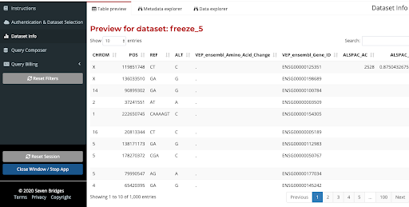
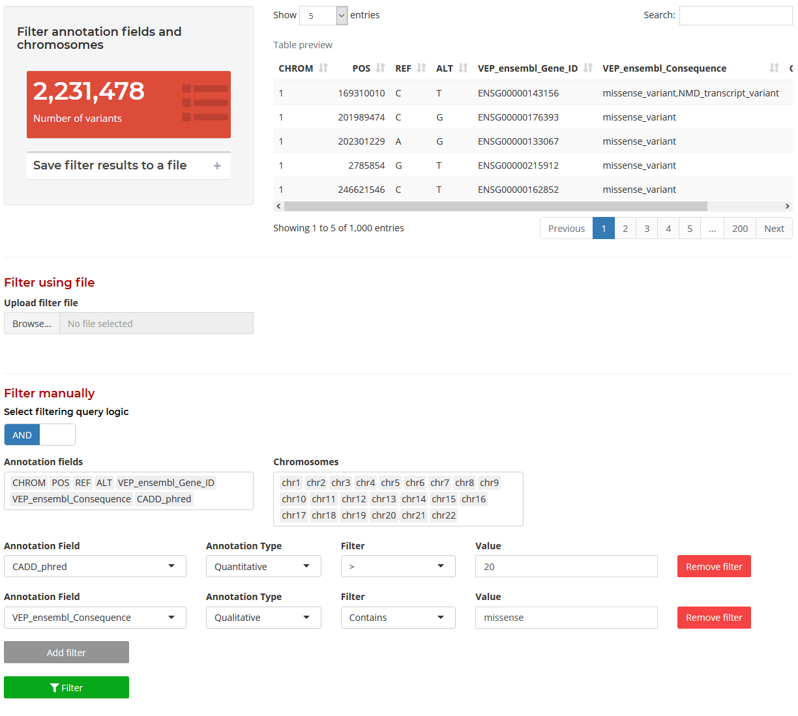

# Annotation Explorer

The Annotation Explorer is an application developed by Seven Bridges in collaboration with the TOPMed Data Coordinating Center which enables users to interactively explore, query, and study characteristics of an inventory of annotations for the variants called in TOPMed studies. This application can be used pre-association testing to interactively explore aggregation and filtering strategies for variants based on annotations and generate input files for multiple-variant association testing. It can also be used post-association testing to explore annotations associated with a set of variants, like variant sets found significant during association testing.

The Annotation Explorer currently hosts a subset of genomic annotations obtained using Whole Genome Sequence Annotator software for TOPMed variants. Currently, annotations for TOPMed Freeze5 variants and TOPMed Freeze8 variants are integrated with the Annotation Explorer. Researchers who are approved to access one or more of the TOPMed Freeze5 studies will have the ability to access the Freeze5 data on Annotation Explorer. Access to annotations for Freeze8 data will be made available after the Freeze8 data is released on BioData Catalyst.

For more information, a link to the Annotation Explorer's Public Project Page can be found [here](https://platform.sb.biodatacatalyst.nhlbi.nih.gov/u/biodatacatalyst/annotation-explorer).

