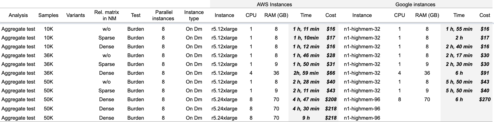

# GWAS with GENESIS workflows

## Overview of the GENESIS pipelines

For researchers interested in performing genotype-phenotype association studies, Seven Bridges offers a suite of tools for both single-variant and multiple-variant association testing on NHLBI BioData Catalyst powered by Seven Bridges. These tools and features include the **GEN**etic **ES**timation and **I**nference in **S**tructured samples \(**GENESIS**\) pipelines, which were developed by the Trans-Omics for Precision Medicine \(TOPMed\) Data Coordinating Center \(DCC\) at the University of Washington. The Seven Bridges team collaborated with the TOPMed DCC to create Common Workflow Language \(CWL\) tools for the GENESIS R functions, and arranged these tools into five computationally-efficient workflows \(pipelines\). 

These GENESIS pipelines offer methods for working with genotypic data obtained from sequencing and microarray analysis. Importantly, these pipelines have the robust ability to estimate and account for population and pedigree structure, which makes them ideal for performing association studies on data from the TOPMed program. These pipelines also implement linear mixed models for association testing of quantitative phenotypes, as well as logistic mixed models for association testing of binary \(e.g. case/control\) phenotypes. 

Below, we feature our GENESIS Benchmarking Guide to assist users in estimate cloud costs when running GENESIS workflows on NHLBI BioData Catalyst powered by Seven Bridges.

## GENESIS Benchmarking Guide

### Introduction 

The objective of the GENESIS Benchmarking Guide is to instruct users on the drivers of cloud costs when running GENESIS workflows on NHLBI BioData Catalyst powered by Seven Bridges. 

For all GENESIS workflows, the Seven Bridges team has performed comprehensive benchmarking analysis on Amazon Web Services \(AWS\) and Google Cloud Provider \(GCP\) instances for different scenarios: 

* 2.5k samples \(1000G data\) 
* 10k samples \(TOPMed Freeze5 data\)
* 36k samples \(TOPMed Freeze5 data\)
* 50k samples \(TOPMed Freeze5 data\)

The resulting execution times, costs, and general advice for running GENESIS workflows can be found in the sections below. In these sections, each GENESIS workflow is described, followed by the benchmarking results and some tips for implementing that workflow from the Seven Bridges Team. Lastly, we included a Methods section to describe our approach to benchmarking and interpretation for your reference.

The contents of this guide are arranged as follows: 

* Introduction
* Helpful Terms to Know
* GENESIS VCF to GDS	
* GENESIS Null model	
* GENESIS Single Association testing	
* GENESIS Aggregate Association testing	
* GENESIS Sliding window Association testing	
* General considerations	

Below is a link to **download the results of our Benchmarking Analysis** described herein. It may prove useful to have this file open for reference when reading through this guide. 











### **Helpful terms to know**

Before continuing on to the benchmarking results, please familiarise yourself with the following helpful terms to know:

_**Tool**_ refers to a stand-alone bioinformatics tool or its Common Workflow Language \(CWL\) wrapper that is created or already available on the platform.

_**Workflow / Pipeline**_ ****\(interchangeably used\) – denotes a number of tools connected together in order to perform multiple analysis steps in one run.

_**App**_ ****stands for a CWL wrapper of a tool or a workflow that is created or already available on the platform.

_**Task**_ ****– represents an execution of a particular tool or workflow on the platform. Depending on what is being executed \(tool or workflow\), a single task can consist of only one tool execution \(tool case\) or multiple executions \(one or more per each tool in the workflow\).

_**Job**_ – this refers to the “execution” part from the “Task” definition \(see above\). It represents a single run of a single tool found within a workflow. If you are coming from a computer science background, you will notice that the definition is quite similar to a common understanding of the term “job” \([wikipedia](https://en.wikipedia.org/wiki/Job_%28computing%29)\). Except that the “job” is a component of a bigger unit of work called a “task” and not the other way around, as in some other areas may be the case. To further illustrate what job means on the platform, we can visually inspect jobs after the task has been executed using the View stats & logs panel \(button in the upper right corner on the task page\):

_**Figure 1.** The jobs for an example run of **RNA-Seq Quantification \(HISAT2, StringTie\)** public workflow_

The green bars under the gray ones \(apps\) represent the jobs \(Figure 1\). As you can see, some apps \(e.g. HISAT2\_Build\) consist of only one job, whereas others \(e.g. HISAT2\) contain multiple jobs that are executed simultaneously.

### **GENESIS VCF to GDS** 

In this section, we detail the process of converting a VCF to a GDS via a GENESIS workflow. This VCF to GDS workflow consists of 3 steps: 

* _Vcf2gds_
* _Unique variant id_
* _Check GDS_

The first two steps are required while the last one is optional. The _Check GDS_ step when included _**is the biggest cost driver**_ in these tasks.

_Check GDS_ tool is QC, which checks whether the final GDS file contains all variants that the input VCF/BCF has. This step is computationally intensive and its execution time can be 4-5 times longer than the rest of the workflow. Also, a failure of this step is something that we experience very rarely. In our results, there is a _Check GDS_ column which is used as an indicator whether the _Check GDS_ was performed or not.

We advise anyone who is using this workflow to consider results from the table below because differences in execution time and price with and without this check are considerable. A final decision on the approach that someone will use depends on the resources that one has \(budget and time\), and the preference of including or excluding the optional QC step. 

In addition, CPU/job and Memory/job parameters have direct effects on execution time and the cost of the **GENESIS VCF to GDS workflow**. A combination of these parameters defines the number of jobs \(files\) that will be processed in parallel. 

For example: 

If a task is run on c5.9xlarge\(36CPUs and 72GB RAM\) with 1CPU/job and 4GB/job the number of jobs run in parallel will be min{36/1,72/4}=18. If a task is run on c5.9xlarge\(36CPUs and 72GB RAM\) with 1CPU/job and 8GB/job the number of jobs run in parallel will be min{36/1,72/8}=9. In this example, the second case would take twice as long as the first. 

The following conclusions were drawn from performed benchmarking:

* Benchmarking showed that the most suitable AWS instances for this workflow are c5 instances.
* For all tasks that we run \(from 2.5k up to 50k samples\), 1CPU and 4GB per job were sufficient.
* For small sample sizes \(up to 10k samples\), tasks can be run on spot/preemptible instances to additionally decrease the cost.
* For samples up to 10k, 2GB per job could suffice, but consider that if we run check GDS step as well, execution time and price will not be much lower because CPU and Mem per job inputs are related only to vcf2gds step and not to the whole workflow.
* We recommend using VCF.GZ as input files rather than BCF, as the conversion process cannot be parallelized when using BCFs.
* If you have more files to convert \(e.g. multiple chromosomes\), we recommend running one analysis with all files as an input, rather than batch analysis with separate tasks for each file. 

### **GENESIS Null model**

The **GENESIS Null model workflow** is not computationally intensive and it is relatively low-cost compared to other GENESIS workflows. For that reason, we present results that we obtained without any optimization below:

The null model can be fit with relatedness matrices \(i.e. mixed models\) or without relatedness matrices \(i.e. simple regression models\). If a relatedness matrix is provided, it can be sparse or dense. The tasks with dense relatedness matrix are the most expensive and take the longest to run. For the **Null model workflow**, available AWS instances appear to be more suitable than Google instances available on the platform.

### **GENESIS Single Association testing**

Results of the **GENESIS Single Association Testing workflow** benchmarking can be seen in the table above. Some important notes to consider when using this workflow:

* _**Null model type effect:**_ The main cost and duration driver in these tasks is the null model type. The null model can be fit without a relatedness matrix \(i.e. simple regression models\), or with a relatedness matrix that can be sparse or dense \(i.e. mixed models\). The table above shows that task cost and execution time increases as the null model is weighted \(dense &gt; sparse &gt; none\). Differences between the model with dense matrix and the model with sparse matrix are significant, which is driven by both increased CPU time and memory required to use a dense matrix. Our advice is to check the relatedness matrix before fitting the model, and _**transform it to sparse if it is dense**_, especially if sample size is large. The null model type has direct influences on further parameters setup such as: instance type selection, CPU per job, Memory per job, etc.  
* _**Instance type:**_ Benchmarking showed that the most appropriate instance type is an AWS r5.x instance. Instance type selection is especially important when we are performing analysis with many samples \(30k participants and above\). In the tasks with up to 30k samples, r5.4xlarge instances can be used, and r5.12xlarge with more participants included. In addition, it is important to note that if a single association test is performed with a dense null model, then r5.12xlarge or r5.24xlarge instances should be picked. When it comes to Google instances, results can be seen in the above table as well. Since there often isn’t a Google instance that is the exact equivalent of the AWS instance, , we recommend choosing the most appropriate Google instance \(matching the chosen AWS instance\) from the list of available Google instances on BioData Catalyst.
* _**CPU and memory per job:**_ ****CPUs and memory per job input parameters are determining the number of jobs to be run in parallel on one instance. For example:

  * If a task is run on c5.9xlarge\(36CPUs and 72GB RAM\) with 1CPU/job and      4GB/job, the number of jobs run in parallel will be min{36/1,72/4}=18. 
  * If a task is run on c5.9xlarge\(36CPUs and 72GB RAM\) with 1CPU/job and 8GB/job, the number of jobs run in parallel will be min{36/1,72/8}=9.

  The bottleneck in single variant association testing is memory, so we suggest carefully considering this parameter and instance type. Workflow defaults are 1 CPU/job and 8GB/job. The table above shows that these tasks require much more memory than CPUs, therefore r.x instances are most appropriate in these cases.  
  The table additionally shows that the task where the null model is fit with the dense relatedness matrix requires the most memory per job. This parameter also depends on the number of participants included in the analysis. 

* _**Maximum number of parallel instances:**_ The default number of parallel instances is 8. The impact of changing this number is mainly reflected through execution time. The tasks with more parallel instances will be finalized faster. This parameter can be set in Execution settings when drafting a task. However, each user has a limited total number of parallel instances and capturing a big number of parallel instances per task leads to a decrease in the total number of different tasks that can run at the same time.
* **Spot instances:** If it is expected for the task to be finalized within a few hours, it can be run on spot instances in order to reduce the execution cost. However, losing a spot instance leads to rerunning the task using on-demand instances which can lead to a higher cost than running the task on on-demand instances from the beginning. That is why spot instances are generally only suitable for short tasks. 

### **GENESIS Aggregate Association testing**

**GENESIS Aggregate association testing** can be performed using burden, SKAT, SMMAT, fastSKAT and SKAT-O tests. Our general conclusions are as follows:

* _**Null model selection:**_ The same as in the single variant association testing, the main cost and duration driver in these tasks is the null model type. The null model can be fit without a relatedness matrix \(i.e. simple regression models\), or with a relatedness matrix that can be sparse or dense \(i.e. mixed models\). The table above shows that task cost and execution time increases as the null model is weighted \(dense &gt; sparse &gt; none\). Differences between the model with dense matrix and the model with sparse matrix are significant, which is driven by both increased CPU time and memory required to use a dense matrix. Our advice is to check the relatedness matrix before fitting the model, and _**transform it to sparse if it is dense**_**,** especially if sample size is large. The null model type has direct influences on further parameters setup such as: instance type selection, CPU per job, Memory per job, etc. 
* _**Instance type:**_ ****Benchmarking showed that the most appropriate instance type is an AWS r5.x instance. The majority of the tasks can be run on r5.12xlarge instances or on r5.24xlarge instances when the null model is with the dense relatedness matrix. Results for Google instances can be seen in the above table as well. Since the Google instance options often do not have an exact AWS equivalent, we selected the closest match from the list of available Google instances on BioData Catalyst.
* _**CPU and memory per job:**_ CPUs and memory per job input parameters determine the number of jobs to be run in parallel on one instance. For example:

  * If a task is run on c5.9xlarge\(36CPUs and 72GB RAM\) with 1CPU/job and      4GB/job, the number of jobs run in parallel will be min{36/1,72/4}=18. 
  * If a task is run on c5.9xlarge\(36CPUs and 72GB RAM\) with 1CPU/job and 8GB/job, the number of jobs run in parallel will be min{36/1,72/8}=9.

  Different tests can require different computational resources.

As can be seen for small sample sizes, up to 10GB per job can be sufficient for successfully completed tasks. One exception is the case when running a task with null model fit with the dense relatedness matrix when approx. 36GB/job is needed. When there are 50k samples, jobs require 70GB. Details can be seen in the table above. In addition to sample size, the memory required is determined by the number of variants included in each aggregation unit, as all variants in an aggregation unit are analyzed together.

SKAT and SMMAT tests are similar when it comes to CPU and Memory per job requirements. Roughly, these tests require 8GB/CPU, and details for different task configurations can be seen in the table below:

* _**Maximum number of parallel instances:**_ ****The default number of parallel instances is 8. The impact of changing this number is mainly reflected through execution time. The tasks with more parallel instances will be finalized faster. This parameter can be set in Execution settings when drafting a task. However, each user has a limited total number of parallel instances and capturing a big number of parallel instances per task leads to a decrease in the total number of different tasks that can run at the same time.
* _**Spot instances:**_ If it is expected for the task to be finalized in a few hours it can be run on spot instances. This will reduce the execution cost. However, losing a spot instance leads to rerunning the task on on-demand instances, which can lead to a higher cost than running the task on on-demand instances from the beginning. That is why spot instances are generally suitable for short tasks.

### **GENESIS Sliding window Association testing**

GENESIS Sliding window association testing can be performed using burden, SKAT, SMMAT, fastSKAT and SKAT-O tests. When running sliding window test is good to know:

* _**Null model selection:**_ The same as in the previous tests the main cost and duration driver in these tasks is the null model type. The null model can be fit without a relatedness matrix \(i.e. simple regression models\), or with a relatedness matrix that can be sparse or dense \(i.e. mixed models\).  The table below shows that task cost and execution time increases as the null model is weighted \(dense &gt; sparse &gt; none\). Differences between the model with dense matrix and the model with sparse matrix are significant, which is driven by both increased CPU time and memory required to use a dense matrix. Our advice is to check the relatedness matrix before fitting the model, and _**transform it to sparse if it is dense**_, especially if sample size is large. The null model type has direct influences on further parameters setup such as: instance type selection, CPU per job, Memory per job, etc.
* _**Instance type:**_ ****Benchmarking showed that for analysis with or without sparse relatedness matrix tasks can be completed on a c5.9xlarge AWS instance. For analysis with dense relatedness matrix included in the null model and with 50k samples or more, r5.12xlarge instances can be used. Also, it is important to note that in this case increasing the instance \(for example from c5.9xlarge to c5.18xlarge\) will not lead to shorter execution time. Furthermore, it can be completely opposite. By increasing the size of the instance we also increase the number of jobs running in parallel. At one point there will be a lot of jobs running in parallel and accessing the same memory space which can reduce the performance and increase task duration. Results for Google instances can be seen in respective tables. Since the Google instance options often do not have an exact AWS equivalent, we selected the closest match from the list of available Google instances on BioData Catalyst.
* _**CPU and memory per job:**_ When running a sliding window test it is important to ensure that CPU resources at the instances that we are using are not overused. Avoiding 100% CPU usage in these tasks is crucial for fast execution. For that reason, it is good to decrease the number of jobs which are running in parallel on one instance.  The number of parallel jobs is highlighted in the summary table as it is an important parameter for the execution of this task. We can choose different CPU and memory inputs as long as that combination gives us an appropriate number of parallel jobs.   ****This is example how the number of parallel jobs are calculated:

  * If we run our task on c5.9xlarge\(36CPUs and 72GB RAM\) with 1CPU/job and      4GB/job, the number of jobs run in parallel will be min{36/1,72/4}=18. 
  * If we run our task on c5.9xlarge\(36CPUs and 72GB RAM\) with 1CPU/job and 8GB/job, the number of jobs run in parallel will be min{36/1,72/8}=9.

  For details on the number of jobs that we’ve set for each tested case please refer to the  table below.

* _**Window size and window step:**_ The default values for these parameters are 50kb and 20kb \(kilobases\), respectively. Please have in mind that since the sliding window algorithm is considering all bases inside the window, the window length and number of windows are parameters that are directly affecting the execution time and the price of the task.
* _**Maximum number of parallel instances:**_ The default number of parallel instances is 8. The impact of changing this number is mainly reflected through execution time. The tasks with more parallel instances will be finalized faster. This parameter can be set in Execution settings when drafting a task. However, each user has a limited total number of parallel instances and capturing a big number of parallel instances per task leads to a decrease in the total number of different tasks that can run at the same time.
* _**Spot instances:**_ If it is expected for the task to be finalized in a few hours it can be run on spot instances. This will reduce the execution cost. However, losing a spot instance leads to rerunning the task on on-demand instances which can lead to a higher cost than running the task on on-demand instances from the beginning. That is why spot instances are generally suitable for short tasks.

**Benchmarking results:** 

### **General considerations**

In this text, we have highlighted the main cloud cost and execution time drivers when running GENESIS analyses. Please have in mind that when running an analysis users may experience additional costs due to different factors such as task failures or need for rerunning the analysis. When estimating cloud costs for your study, please account for a cost buffer for these two factors as well.

To prevent task failures, we advise you to carefully read app descriptions and if you have any questions or doubts, contact our Support Team at **support@sevenbridges.com**. Also, using memoization can help in cost reduction when rerunning the task after initial failure. 

### **Methods** 

Throughout this document, it is important to note that the figures in the tables above are intended to be informative as opposed to predictive. The actual costs incurred for a given analysis will also depend on the number of samples and number of variants in the input files. For our analysis described above, we selected 1000G and TOPMed Freeze5 data as inputs. For TOPMed Freeze5, we selected cohorts of 10k, 36k, and 50k subjects. The benchmarking results for the selected tasks would vary if the cohorts were defined differently.  

The selection of instances is another factor that can lead to variation in results for a given analysis. The results highly depend on the user’s skill to choose an appropriate instance and use the instance resources optimally. For that reason, if two users run the same task with different configurations \(different instance type CPU/job and/or RAM/job parameters\), the results may vary.

The results \(execution time and cost\) are directly connected to the CPU per job and Memory per job parameters. Different resources dedicated to a given job will result in a different number of total jobs run on the selected instance, as so with the different execution time and cost. For that reason, setting up a task draft properly is crucial. In this document, we provided details on what we consider optimal  CPU and Memory per job inputs for TOPMed Freeze5 and 1000G data. These numbers can be used as a good starting point, bearing in mind that each study has its own unique requirements.  

**For both Single and Sliding Window Association Testing:**

Please note that results for single and sliding window tests are approximations. To avoid unnecessary cloud costs, we performed both single and sliding window tests only on 2 chromosomes. These results were the basis on which we assessed the cost and execution time for the whole genome.  

  
The following is an explanation of the procedure we applied for **GENESIS Single Association testing workflow** and TOPMed freeze5 data \(the similar stands for **GENESIS Sliding window Association testing workflow**\):   

In **GENESIS Single Association testing workflow,** the variants are tested in segments. The number of segments that the workflow will process is a ratio of the total number of variants and a segment length \(which is one of the input parameters in this workflow\). For example: if we are testing a whole genome with 3,000,000,000 variants and use the default segment length value of 10,000kb, we will have 300 segments. Furthermore, if we use the default value for maximum number of parallel instances, which is 8, we can approximate the average number of segments that each instance processes: 37. 

**The GENESIS Single Association testing workflow** can process segments in parallel \(processing of one segment is a job\). The number of parallel segments \(jobs\) depends on the CPU per job and Memory per job parameters, and can be calculated as described previously. For example: if we are running the analysis on a c5.9xlarge instance \(36 CPUs and 72GB RAM\) with 1 CPU/job and 4GB/job, we will have 18 jobs in parallel. Knowing that each of our 8 instances is processing approximately 37 jobs in parallel it means that each instance will have approximately 2 cycles. Furthermore, knowing the average job length we can approximate the running time of 1 instance: it will be 2 cycles multiplied by average job length. Since the instances are running in parallel, this will be the total execution time. Lastly, when execution time is known, we can calculate the task price: the number of instances multiplied by execution time per hour, multiplied by instance price per hour. For each tested scenario in our benchmarking analysis, we obtained the average job length based on the corresponding tasks  which included 2 chromosomes, such that the total number of jobs was above 30.

