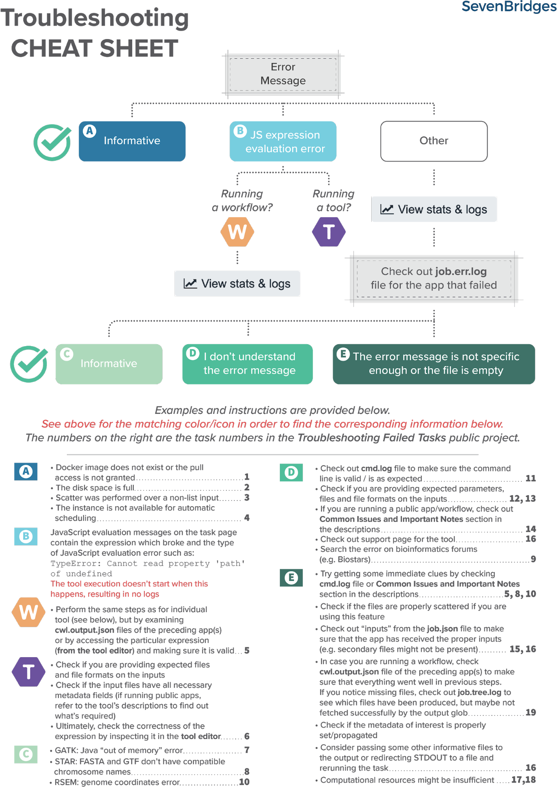

# Troubleshooting Tasks

One of the key steps to becoming an advanced user and being able to fully understand and leverage the power of BioData Catalyst powered by Seven Bridges is to learn how to detect and correct errors that prevent the successful execution of your analyses. The Troubleshooting tutorial presents some of the most common errors in task execution on the platform and shows you how to debug and resolve them. There is also a corresponding public project on the platform called "Troubleshooting Failed Tasks" which has examples of the failed analyses presented in the written tutorial.

Find the written tutorial here: [https://sb-biodatacatalyst.readme.io/page/troubleshooting-tutorial](https://sb-biodatacatalyst.readme.io/page/troubleshooting-tutorial)

Find the platform public project with examples here: [https://platform.sb.biodatacatalyst.nhlbi.nih.gov/u/biodatacatalyst/troubleshooting-failed-tasks](https://platform.sb.biodatacatalyst.nhlbi.nih.gov/u/biodatacatalyst/troubleshooting-failed-tasks)

