# Creating, testing, and scaling CWL workflows

## **Creating, Testing and Scaling CWL Workflows**

### **Section overview:**

In this section, the reader will first learn how the Seven Bridges Software Development Kit \(SDK\) enables the easy creation of CWL workflows that will benefit the greater BDCatalyst community. We will review the benefits of the SDK and then walk through an example of workflow creation, testing, and scaling. There are also links to more detailed resources for further reading.

### **Helpful Terms to Know on Seven Bridges:**

_**Wrapping:**_ ****The process of describing a command-line tool or custom script in Common Workflow Language \(CWL\) so that it can be easily run in multiple cloud environments, dynamically scale compute requirements based on inputs, and be inserted into distinct analysis pipelines.

_**Tool:**_ ****A CWL description of a reusable piece of software that performs one specific function. An example is the bwa read alignment tool which can be applied to multiple workflows in different contexts. Tools need to have several things specified in the CWL description that includes Docker image, Linux base command, input files \(or parameters\), and output files. Tools can be used in completely disparate workflows and can be thought of as building blocks.  

_**Workflow:**_ ****Chains of connected tools to accomplish a full analysis. Tools are often connected in a specific way to enable maximum computational efficiency and are also constructed to accomplish a specific analysis goal. Whereas tools describe a single software step \(e.g. alignment or read sorting\), a workflow describes a full analysis \(e.g. variant discovery, differential expression, or multiple variant association tests\).

_**App:**_ An app is a general term to refer to both tools and workflows. The platform user will typically only see the term “app” in reference to mixed groups of tools and workflows, such as in the **Public Apps Gallery**, the **Apps** collection tab, or within a workspace.

### **Introduction to Seven Bridges Software Development Kit**

_Throughout this guide, it will be useful for the reader to refer to our documentation found for each section. For the Seven Bridges Software Development Kit documentation, please see the following:_ [_https://sb-biodatacatalyst.readme.io/docs/sdk-overview_](https://sb-biodatacatalyst.readme.io/docs/sdk-overview)

NHLBI BioData Catalyst powered by SevenBridges \(Seven Bridges\) provides a full _**Software Development Kit \(SDK\)**_ that enables the BioData Catalyst community to easily create CWL apps that can be tested and scaled up to production level directly on the platform. Once validated by the user, these workflows can be exported and published on Dockstore so they can become searchable and findable by other users.  

The SDK consists of a tool editor and a pipeline editor. Both are based on the open source project _**Rabix**_, a portmanteau of "Reproducible Analyses for Bioinformatics" \(for more information, see [rabix.io](https://rabix.io/)\). The goal of the SDK is to guide the user through the process of creating fully functional analytical pipelines that can be tested, scaled up to population-scale analysis, and shared with the research community. The SDK also has built-in version control at the tool and workflow level to enable full reproducibility of previous versions.

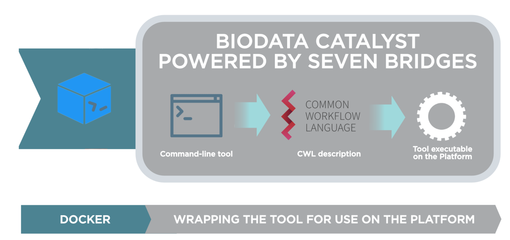

The Tool Editor guides the user through the creation of a portable CWL description by linking a pre-built Docker image \(see section _Working with Docker_\) to a command line or script that will be run inside the container. The above image shows the tool wrapping process. The Tool Editor enables users to easily create CWL by filling out the GUI template \(Figure 4\). This simplifies the technical aspects of this process and makes it as easy as possible for users to get their tools set up on the platform. The CWL code can also be edited directly in the tool editor if that is desired. For users working with JavaScript, JavaScript dynamic expressions can be tested without having to leave the tool editor.

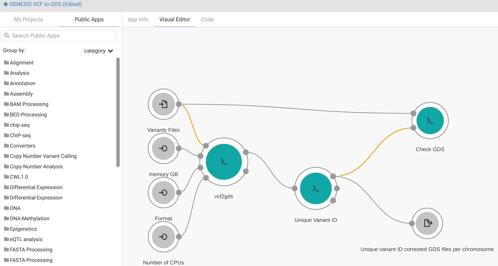

Learn more via this [tutorial](https://sb-biodatacatalyst.readme.io/v1.0/docs/workflow-editor-tutorial).

The Workflow Editor enables users to create full pipelines by linking together multiple discrete tools. The workflow editor is a drag-and-drop visual interface that makes it easy to build even the most complex pipelines.

Before we dive into more detail on how to use the Tool Editor and the Workflow Editor, it is important to understand the distinction between tools and workflows. The distinction is only present in the CWL, and it is an important one. Wrapping a tool requires knowledge of Docker and Linux command lines. The Tool Editor helps the user get past even the most technical and dynamic of command-line and script issues, with the goal being the creation of a reusable and shareable component. For building workflows, the Docker and Linux command lines are abstracted away to enable less-technical users to build full analytical pipelines. We can refer to this as “separation of concerns.” Each tool should be designed to handle one functional aspect, and therefore will be able to operate in multiple analytical pipelines. For example, BWA-MEM or the Samtools suite can be used in both DNA analysis workflows and RNA analysis workflows. 

Linking together multiple tools into a full computational pipeline can have many advantages. It is important to understand the benefits of building a full and robust workflow that includes each of the analysis steps. The most apparent benefit is that it makes the entire pipeline easier to share, as there will only be one resulting CWL file. The CWL file is a human-readable text file that can be distributed digitally in multiple ways, such as through Dockstore, Seven Bridges, GitHub, or over email. A novice user can easily reproduce the full analysis using the one file. They can also use the SDK to make adjustments if necessary, or even decompose the workflow to get at the constituent tools for use in other contexts \(more on this below in the section _Version Control_, _Publishing_, and _Validation of workflows_\).  
  
The Seven Bridges platform has built-in optimizations to execute a workflow for maximum efficiency and cost savings. For example, workflows only save final output files back to the project. Since intermediate files from earlier steps in the workflow are not saved, they do not accumulate cloud storage costs, saving funds that would otherwise be used for intermediate file object storage. Users can still make use of intermediate files for subsequent reruns of a task by simply turning on “memorization” for that task and intermediate files will be re-used where appropriate.

Finally, linking multiple tools together also has the added benefit of increasing computational efficiency. When running workflows, multiple tools can use the same compute instance if multiple CPU cores are available. This saves time and funds, and increases the ability to run jobs in parallel with no additional configurations.

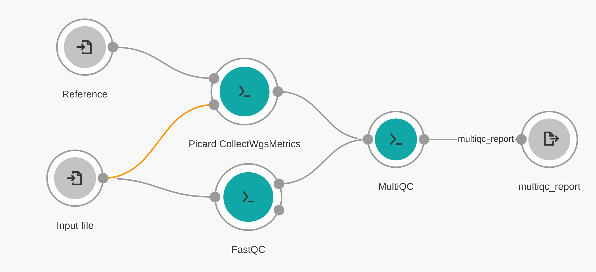

In the following sections, we will build the workflow in the above image. Here, we can visually see the importance of creating a workflow: running each of these tools separately would require more steps from the user and require more unnecessary data to be moved back and forth from the cloud computational instance to the user’s workspace. Therefore, running as a single workflow achieves the best efficiency.  

### **Creating A Development Project**

_Before getting started with this section, we recommend first creating a development workspace \(called projects on Seven Bridges\) to house the new tool\(s\) and workflow\(s\) while they are being created and tested. Please see the Seven Bridges_ [_Getting Started Guide_](https://bdcatalyst.gitbook.io/biodata-catalyst-documentation/analyze-data/seven-bridges/getting-started-guide#create-a-project) _for detailed instructions about how to create projects._

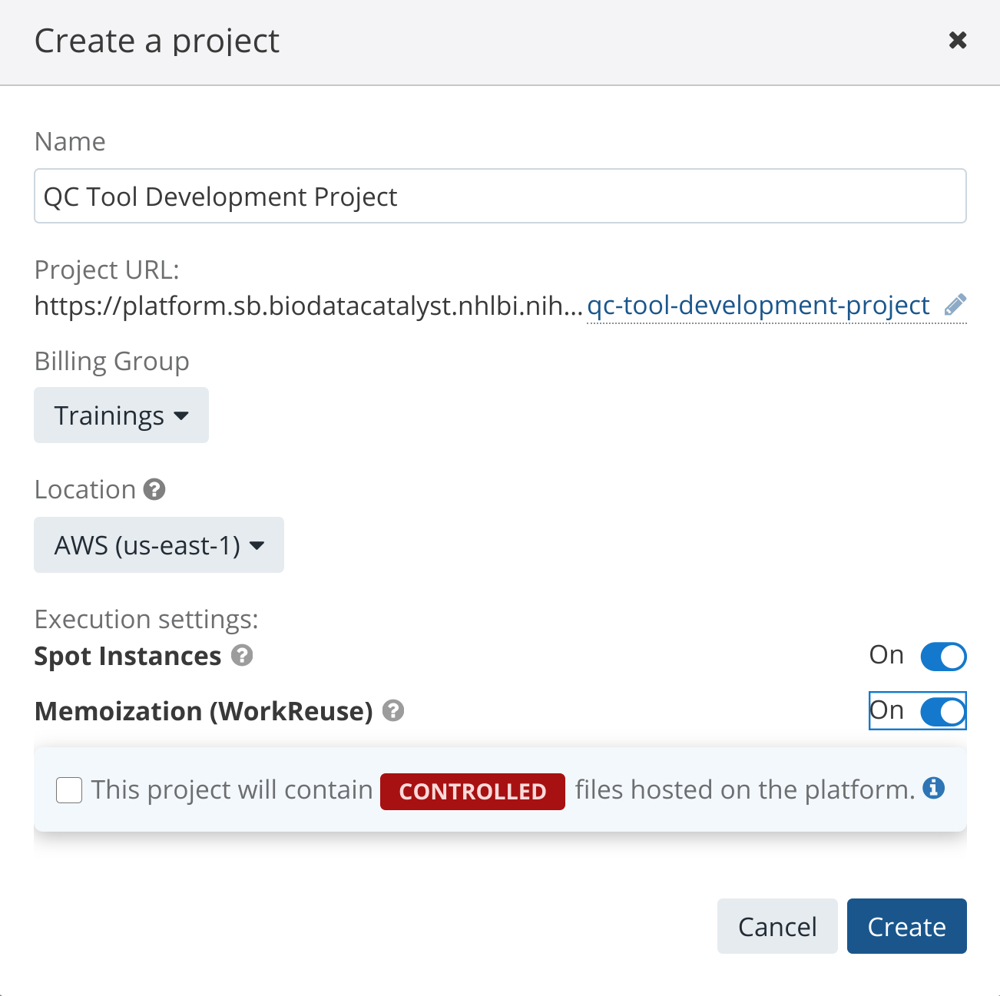

Figure 6 shows all the options available when creating a project on Seven Bridges including selecting the _Billing Group_.  If used conservatively, the NHLBI BioData Catalyst pilot funding is adequate to cover the costs associated with developing a tool or workflow on the platform. 

### **Outlining Your Workflow**

For the purposes of this tutorial, we will create a Next Generation Sequencing \(NGS\) alignment Quality Control \(QC\) workflow as an example problem. BioData Catalyst hosts data from TOPMed and TOPMed studies generally have the most up to date alignments to HG38. Therefore, for this example tutorial we will \(1\) create a pipeline that can be used to make sure these CRAMs have high quality reads, and \(2\) perform alignment read depth QC. We will also show how to bring a new tool to the platform that will combine the outputs of the previous tools. 

Researchers should outline their pipeline into individual steps. These steps should correspond to individual software executables \(i.e. bwa, samtools\) or scripts \(i.e. R, python, shell\).

A great place to outline your tool is in your development project description, shown below:  

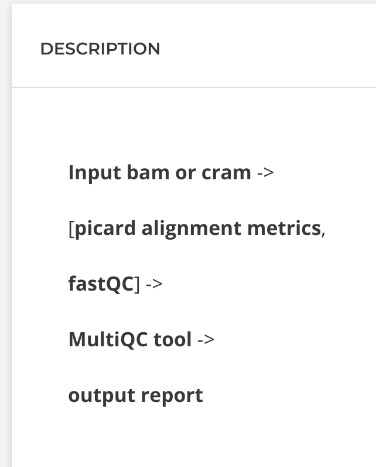

It is important to determine if there are tools \(steps in your outline\) that have already been wrapped and are published in either Dockstore or the Seven Bridges Public Apps Gallery. This reduces the time in porting analytical workflows to the cloud because these steps will not have to be re-validated or re-benchmarked. This also promotes developing with “separation of concerns.” This means that every tool \(step\) can be versioned, tested and improved without adversely affecting the entire workflow.  
  
We recommend searching the Seven Bridges Public Apps [Gallery](https://platform.sb.biodatacatalyst.nhlbi.nih.gov/resources/public-gallery/apps) and the [BioData Catalyst Organization](https://dockstore.org/organizations/bdcatalyst) on Dockstore to find validated and reusable components. 

Tools from the Seven Bridges Public Apps Gallery can be easily imported directly into your project. These apps have been validated and optimized for the cloud. By re-using existing tools, the development time is dramatically reduced.

Searching the [Public Apps Gallery](https://platform.sb.biodatacatalyst.nhlbi.nih.gov/resources/public-gallery/apps) reveals that CWL tools are available for [Fastqc](https://platform.sb.biodatacatalyst.nhlbi.nih.gov/resources/public-gallery/apps/3f8cdc89-54ec-4ccd-8f99-20ac4b676fae) and [Picard CollectWgsMetrics](https://platform.sb.biodatacatalyst.nhlbi.nih.gov/resources/public-gallery/apps/a13c45b1-09dd-4cdb-9843-e950b7b2e1e9). Therefore, the only tool that needs to be wrapped is MultiQC.

### **Wrapping Your Tool**

As described previously, the process of describing a command-line tool or script in CWL so that it can be run in a cloud environment either by itself or in a larger workflow is known as wrapping. Let us proceed with wrapping our MultiQC tool. The first step is to either \(1\) create a Docker image from a Docker build file or \(2\) find one available to us on a hosted repository. Next, we should run the Docker locally to test out the basic command line. If a Docker image was previously created and hosted for us we can use that to save time. On the other hand, if the software programs are not available in a single Docker image you will need to build it. Please see the section on [Working with Docker](https://docs.google.com/document/d/1_pg5edwOEieXSfxmeoV8PeCZbVPBg7-QUiE4_UsfhnU/edit?ts=5f7b54bc&pli=1#heading=h.feoc3trvjrca) for more information on creating images.

For this example, a MultiQC Docker image is available for us via [biocontainers.pro](https://biocontainers.pro/#/tools/multiqc) with the image specially hosted at _**quay.io/biocontainers/multiqc:1.9--pyh9f0ad1d\_0**_.

To use the SDK tool editor to wrap MultiQC, we will follow these steps in the development project:

**Step 1:** In the development project, click on the Apps tab and select “Add app.”

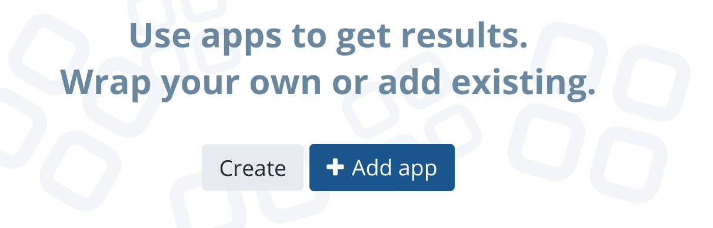

**Step 2:** On the next screen, select “Create a Tool.”

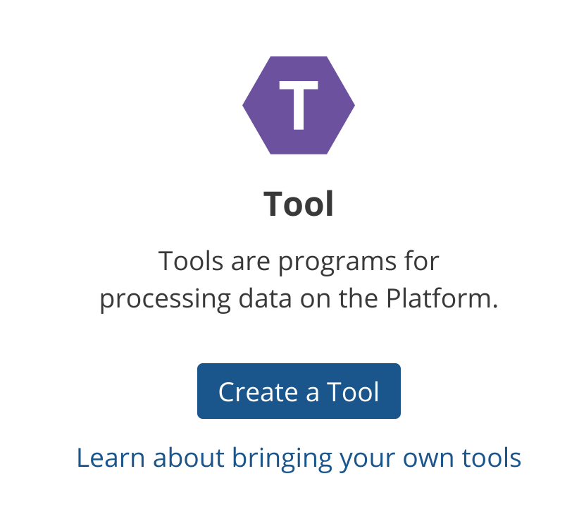

**Step 3:** Name your tool “MultiQC” and create a version CWL 1.0 tool. This will automatically take you to the visual Tool Editor.

**Step 4:** To complete our wrapping of MultiQC, we need to fill in the Docker Image, Base Command, Input Ports, and Outputs sections in the Visual Editor. 

* The Docker image/repository is **quay.io/biocontainers/multiqc:1.9--pyh9f0ad1d\_0**.
* For this example, the base command \(see screenshot below\) is simply: MultiQC multiqc \(See _Creating a tool from a script_ for how this will look for your own custom script\).
* For this example, we just need one input port which is an array of our quality control files from the upstream apps. We do not need any additional parameters for this example. If you are wrapping your own custom script, you can configure multiple input ports of different types.
* Please see Figure 8 for where to fill in the details.

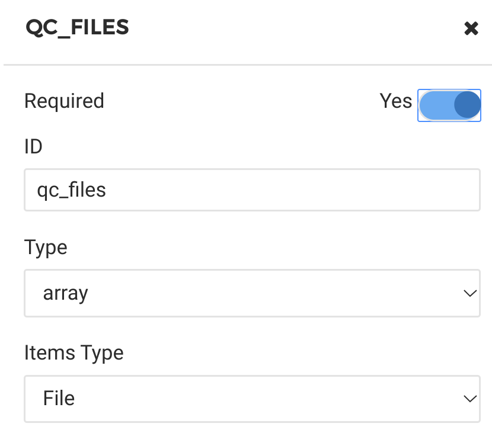

Be sure to create an input of type “array” which has items of type “File.” The MultiQC executable does not require that inputs of different types be prefaced with any flags or indicators. When wrapping an executable that requires distinguishing inputs \(e.g. “--arg1 --arg2”\), multiple inputs would need to be added.

The tool editor gives the user a preview of the resulting command line: 

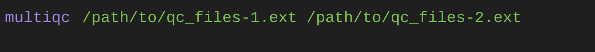

This is a relatively simple one and the arguments are just the full paths in the input file array. Features such as file metadata and JavaScript expression can be used to create a more sophisticated Linux command line for other tools.

* The output port is the comprehensive MultiQC report \(Figure 9\) that the software tool creates. For this output we will use a wildcard inside the “glob” field. The “glob” is simply how the tool will select which files to keep from the current working directory. The user can create as many output ports as necessary. Since MultiQC is a simplification and summarization tool we will only have the one HTML report which can be acquired using a glob of “\*.html.”  

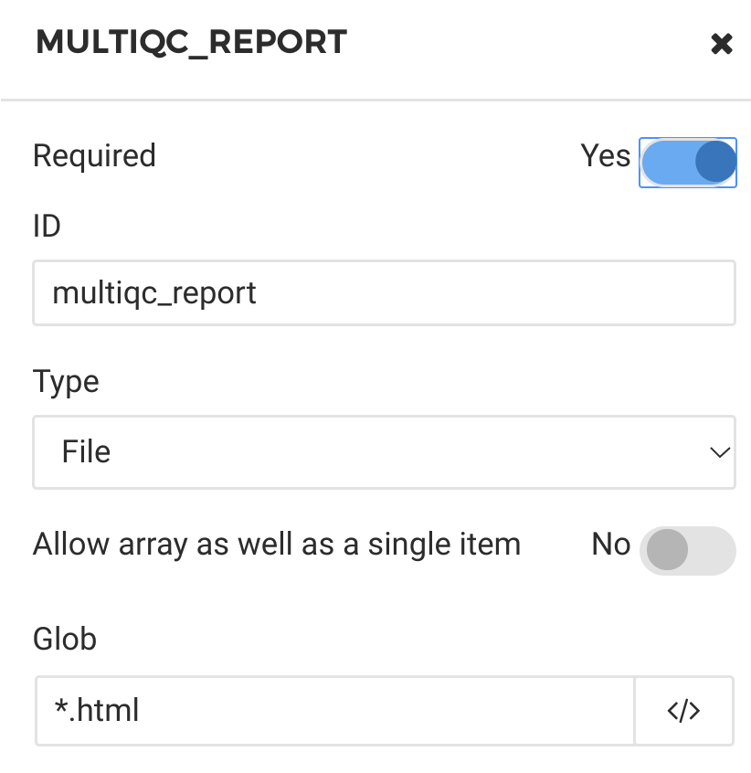

The output “glob” field \(like all fields in the tool editor\) has the ability to use JavaScript expressions to dynamically search for files in a very specific manner such as the full path that is based on the input files or to scan through a deep folder structure.   

The completed tool will look like this:

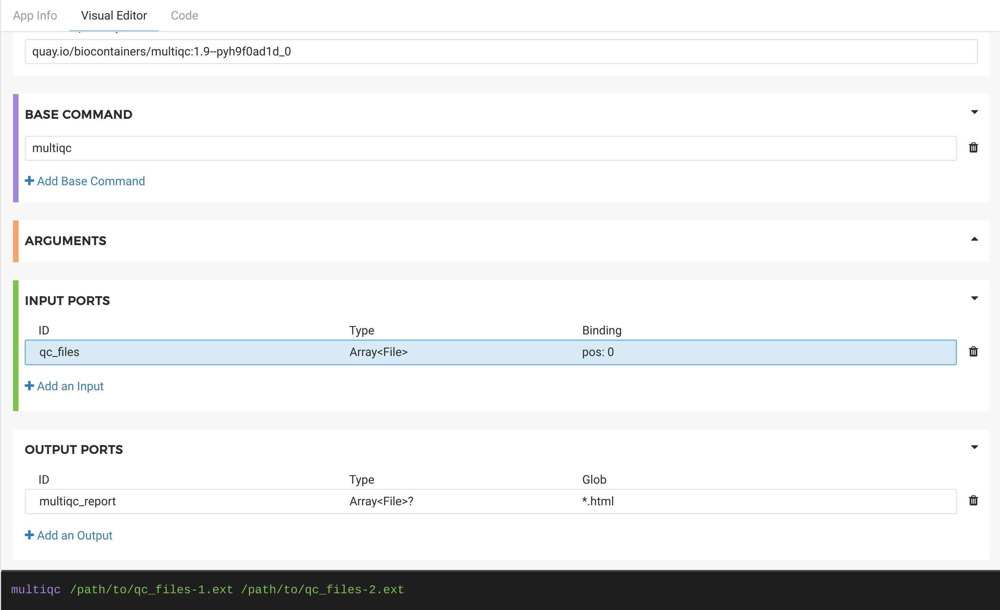

Finally, we should consider the Computational Resources section of the Tool Editor. Here it is important to specify the minimum compute required. Because our example tool is not compute intensive we can require a minimal amount of RAM and CPU. Through JavaScript dynamic expressions we can customize these computational requirements to scale with either the input files sizes or user input parameters. The Seven Bridges job scheduler will select the appropriate cloud instance\(s\) based on these constraints. In the next section, we will discuss how the user can also specify a suggested AWS or GCP cloud instance by adding “hints.”

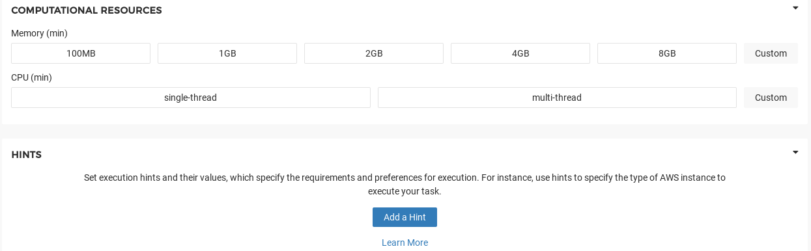

Tools can be tested by themselves, but in some cases it makes more sense to test the tool in the context of the complete workflow. For simplicity, we will add MultiQC to the workflow and use the output from the tool upstream of MultiQC in the workflow to test the MultiQC tool.

Finding appropriate test data is key to testing tools and workflows. Wherever possible, we recommend working with data that is small in size when testing tools and workflows. Small in size generally means a small size on disk and usually correlates to a smaller number of NGS reads, smaller number of variants, or smaller number of samples. Sometimes this small data is referred to as a “toy” dataset or a “subset” of data. Testing the tool wrapper will generally require multiple test runs using this small data set.

Seven Bridges hosts a number of test files in the [Public Files Gallery](https://platform.sb.biodatacatalyst.nhlbi.nih.gov/resources/public-gallery/files) that range from reference files to test size input data. Users can link these test files to their project instead of uploading their own test data to avoid storage costs. One of these test files is the human whole exome sequencing sample [merged-normal.bam](https://platform.sb.biodatacatalyst.nhlbi.nih.gov/resources/public-gallery/files/dfaca822-cf5f-4043-bf7f-3c8dd522a63d) which we will use for testing here. You can view the provenance of this test file by clicking on the file name and then on “metadata”:

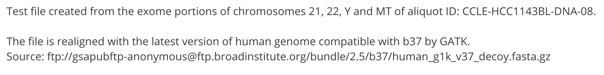

This file is a “subset” of the whole exome data and is therefore a good choice for testing since the cost per analysis will be less than if data from all chromosomes were used. Tools should always be tested separately. When wrapping a tool the user should obtain access to data they can use for testing. The above metadata description also tells us the exact reference that was used for the read alignment. Seven Bridges also has the same reference file in the Public Files Gallery called [human\_g1k\_v37\_decoy.fasta](https://platform.sb.biodatacatalyst.nhlbi.nih.gov/resources/public-gallery/files/1536a7fa-04bc-4d19-a24d-f1e6a4025352).

Make sure to copy both testing files to your development project. Because these files are hosted in the Public Files Gallery, linking these files to your project will not lead to any additional storage costs.

### **Extending Into A Workflow**

The next step is to add our tool to a workflow with the upstream QC tools. We will use the pipeline editor to do this.

**Step 1.** The first step is to create a new “blank canvas” in the workflow editor. Go to the Apps tab in the development project and click on “Add app.” This time select “Create a workflow”.

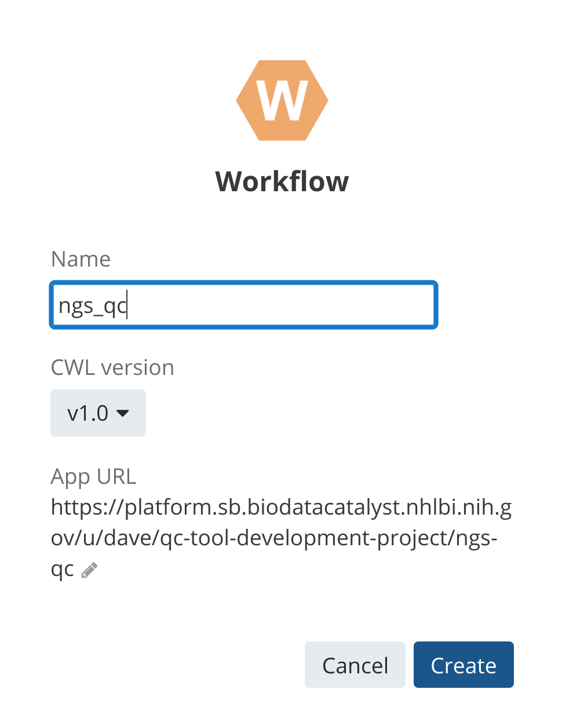

**Step 2.** After creating the workflow, the next screen is a blank canvas in the Workflow Editor. From here, we can add multiple QC apps that are compatible with MultiQC to the canvas directly from the Public Apps Gallery. Search for “fastqc” and then for “picard alignment metrics” and use the mouse to drag them onto the workflow canvas.

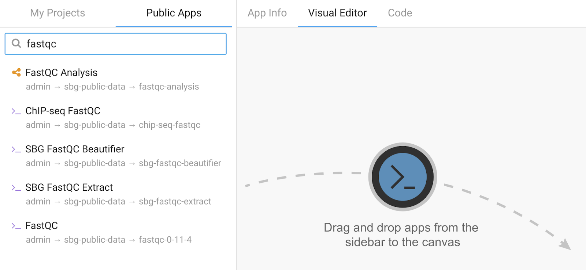

Add the MultiQC CWL tool from the current project in the “My Projects” tab.  The screen will look like this:

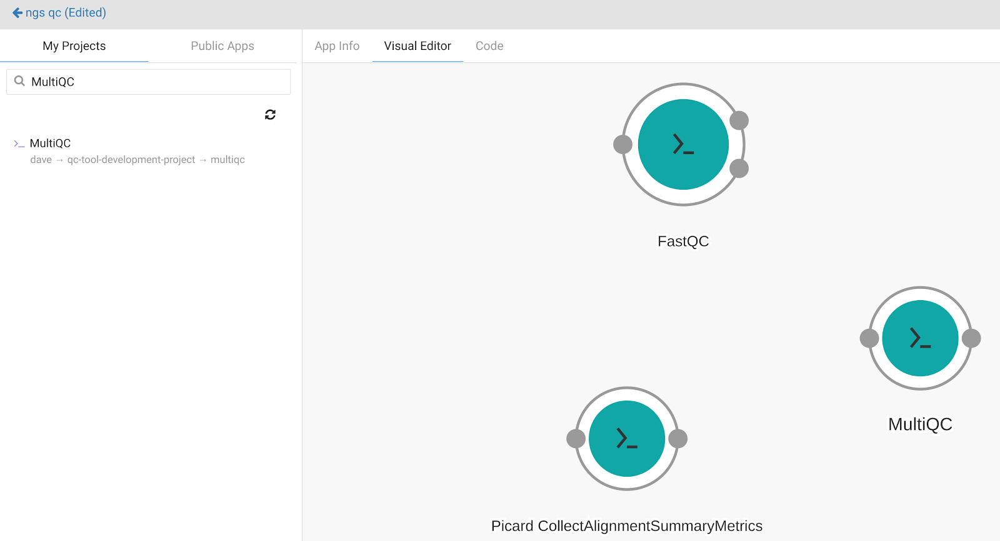

The next step is to connect the apps together. The nodes that are displayed on the workflow canvas represent apps. The input and output ports are represented by small circles on the perimeter of the node. Circles on the left of the node represent **input ports** whereas the ones on the right indicate **output ports**. Use the mouse to connect the wire frame together. The completed workflow will look like this:

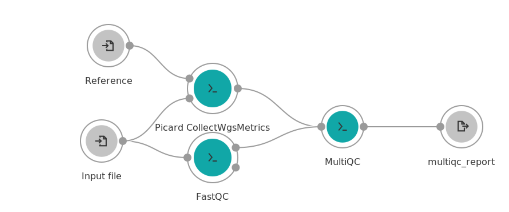

This simple workflow highlights several advantages of the workflow editor. Notice that the “input file” input port node which represents an aligned bam file for this workflow feeds into both the Picard CollectWgsMetrics and FastQC tools. This means that the end user only needs to specify this input one time when running the task and that the alignment metrics and FastQC tools will run in parallel, conserving time and funds.  

Take note that one of the FastQC outputs is not connected to any downstream tool. In this case, this output port creates a zip file of the raw report data. However, the MultiQC tool does not need this output file and therefore it does not need to be moved or persisted outside the Docker container of the FastQC tool. In addition, although the CollectWgsMetrics and FastQC nodes feed into MultiQC, they do not have output nodes for themselves. This workflow has only 1 output which is the MultiQC html report. The intermediate reports will be saved temporarily in case the tool needs to be re-run, but will not persist in the file page of the user’s workspace, highlighting another way the workflow conserves funding.

We can test the workflow directly on the platform. Seven Bridges has multiple reference files in the Public Gallery. A completed task of the workflow will have one interactive report as an output. See the completed task in Figure 12.

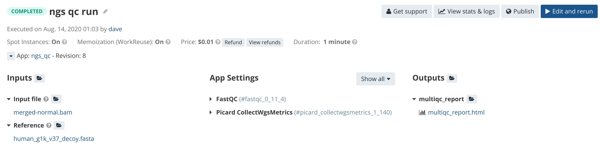

The output of MultiQC is an interactive report that is viewable directly on the platform:

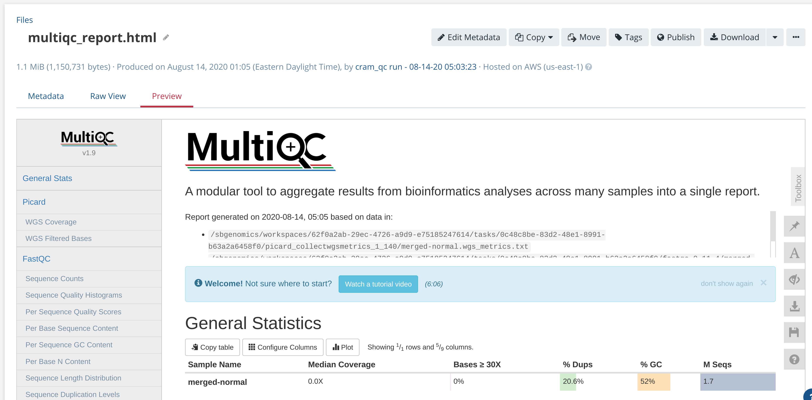

For more information about the workflow editor and for other examples please refer to the following materials in the Seven Bridges documentation:

* [about the workflow editor](https://sb-biodatacatalyst.readme.io/docs/about-the-workflow-editor)
* [create a workflow](https://sb-biodatacatalyst.readme.io/docs/create-a-workflow-1)
* [workflow editor tutorial](https://sb-biodatacatalyst.readme.io/docs/workflow-editor-tutorial)

### Scaling up your analysis 

There are two easy ways to scale your workflows on Seven Bridges. We refer to these as “batching” and “scattering.” Batch analysis separates files into batches or groups when running your analysis. The batching is done according to the specified metadata criteria of your input files or according to a files list you provide. Batch analyses can be defined at run time with no special setup in the tool. However, each batch is run on a separate instance. For more information on batch analyses, please see here.

Using our NGS QC workflow example we can create a batch task for every file in the input file port, as shown in Figure 14. This batch task will create 1 child task for each input bam file.

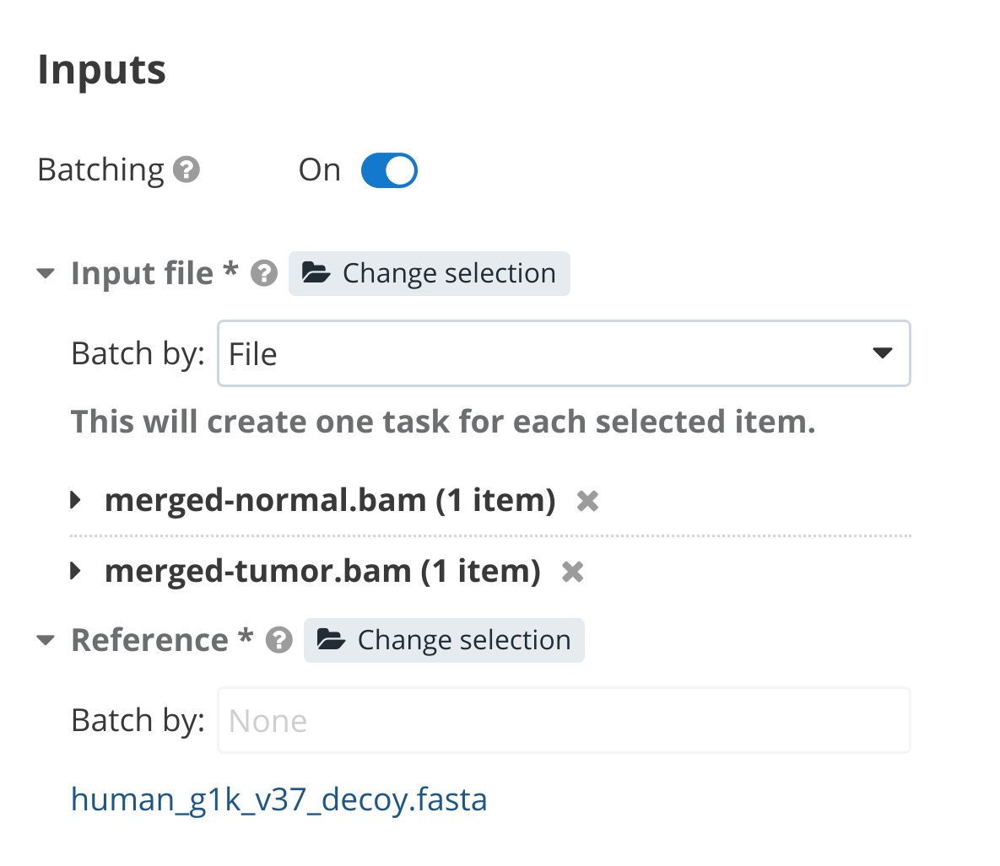

We can use another method called “scattering,” which operates inside a single task. This means that a workflow can utilize multiple cores in a single compute instance, which is often more efficient than using multiple instances. Scattering can only be used at the workflow level, not at the tool level. To use scattering, we need to edit our workflow. We make the input file of type “array” and the array type “file” as shown in Figure 15. 

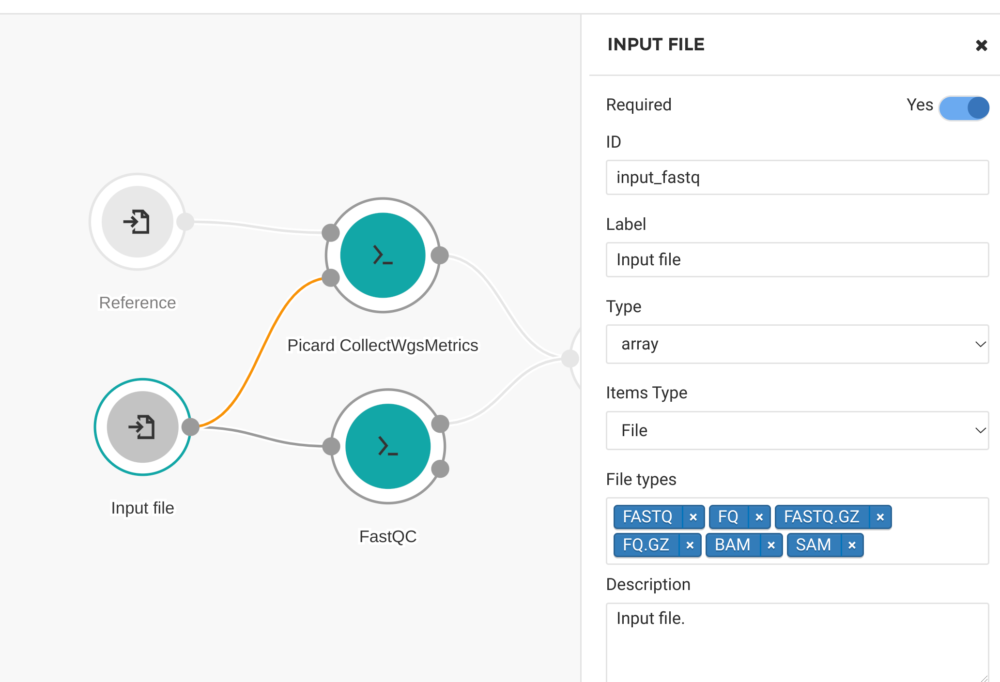

Click on each of our QC tools and select “Step.” In the “step” panel select the appropriate input to scatter on. In this case we scatter by “input\_bam” for the Picard Collect WGS Metrics tool and by “input\_fastq” for the FastQC tool . When the workflow is run, the user can select multiple input files and each of them will be processed in parallel on separate compute nodes.

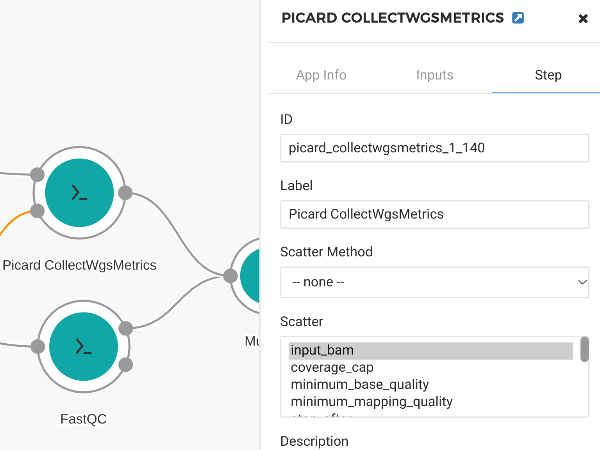

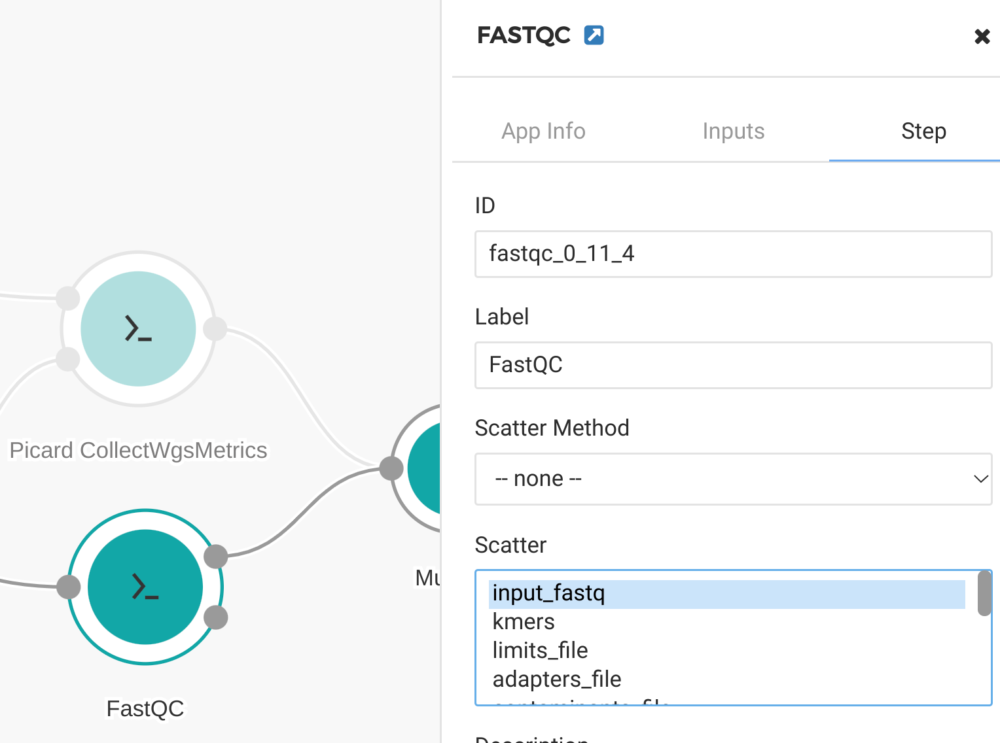

This was a brief introduction to the powerful scatter ability of the workflow editor. Please see the section [_Comprehensive tips for reliable and efficient analysis set-up_](https://sb-biodatacatalyst.readme.io/page/comprehensive-tips-for-reliable-and-efficient-analysis-set-up) of the Seven Bridges documentation for more information.

When running your custom workflow, you can define computational requirements so that there is enough memory and CPUs to run multiple jobs in parallel. For example, if your tool requires 4GB of RAM and you select an instance with 8 CPUs and 32G RAM, you will see that 8 jobs are running in parallel when you run your workflow as shown in Figure 18.

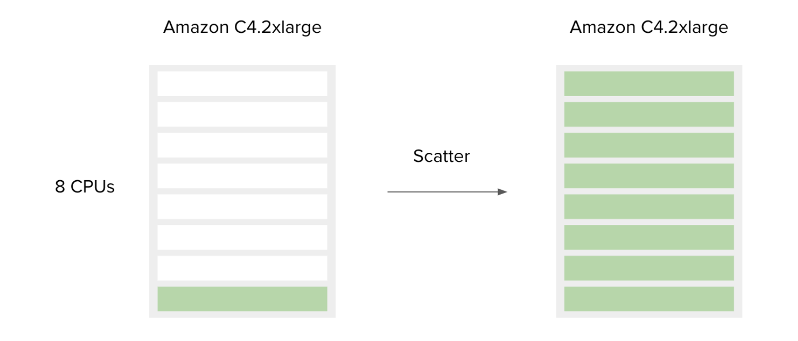

If you have followed this guide, your tool has now been wrapped and added to a workflow. It has also been tested on a “toy” dataset and validated against real data for your project. In the next sections, you will learn how to export CWL from the platform, create a GitHub repository for version control, and also how to publish to Dockstore.

### **Creating a tool from a script**

Not all tools need to be command line binaries. Many researchers bring their shell scripts, Python and R scripts to Seven Bridges and this is all possible using the Seven Bridges Tool Editor.   

For example, if we wanted to run an R script using the GENESIS Docker image we could do that without having to recreate the Docker image. To run a specific script that is not included in the Docker image, use the “File requirements” field shown in Figure 19. Specify a name for your file and paste in the file contents.

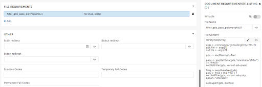

Then enter the name of the file in the “Base command” section along with the command required to execute it \(e.g. Rscript\):

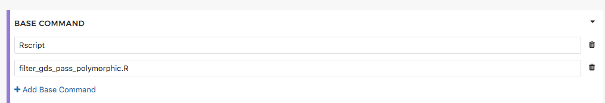

Similarly, if you were using a python script the base command would be “Python.”  Using the files requirements section of the Tool Editor we can execute any type of script without having to create a new Docker container.  

### **Additional resources**

* [**Getting Started with CWL**](https://docs.dockstore.org/en/develop/getting-started/getting-started-with-cwl.html)
* [**CWL Best Practices**](https://docs.dockstore.org/en/develop/advanced-topics/best-practices/best-practices.html)
* [**Training Exercises**](https://github.com/dockstore/bcc2020-training) **\(CWL solutions available for the same exercise\)**
* \*\*\*\*[**SevenBridges Introduction to tool wrapping**](https://sb-biodatacatalyst.readme.io/docs/introduction-to-tool-wrapping)
* [**Task Troubleshooting Guide**](https://sb-biodatacatalyst.readme.io/page/troubleshooting-tutorial)

