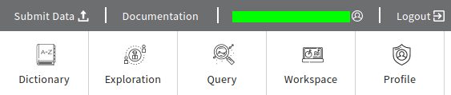
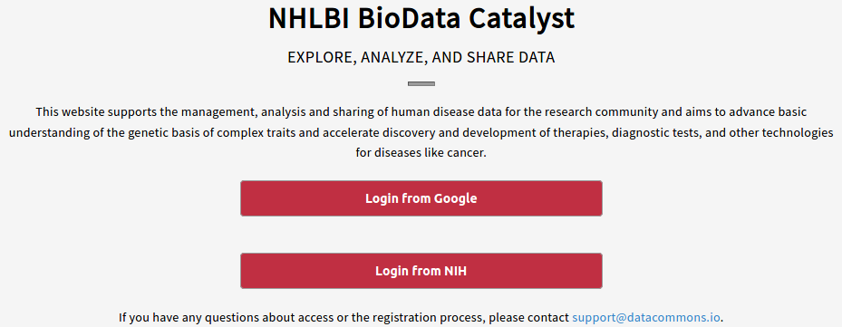

# Discovering Data Using Gen3

## Login to Gen3 BioData Catalyst

To view the data that is available to the user on Gen3 BioData Catalyst \(BDC\), please start by going to the login page. At this time, the BDC offers two forms of login, one using a Google account and the other using an NIH login. The NIH login is based on your [eRA Commons account](https://public.era.nih.gov/commons/public/login.do) and access is granted through [dbGaP](https://dbgap.ncbi.nlm.nih.gov/aa/wga.cgi). Please make sure to use the correct login method that contains access to your available projects.

Once the user has successfully logged in, the user name will appear in the upper right hand corner above the Gen3 Common's tiles.

## Using Exploration

After clicking on the Exploration option in the upper right hand toolbar, the user will see a page with summary statistics and facets on the left side.

### Data Tab

The left side panel of data facets allows users to leverage the DCC harmonized variables to create a custom cohort in the "Data" tab. When the facets are selected, the display will be updated with the new applied filter. If no facets have been selected, then it will display all available data. At this time, a user can filter based on three categories of information:

* `Medical History`: contains information that would be standard to collect information from medical records for the subject.
* `Diagnosis`: contains data from the investigation, analysis and recognition of the presence and nature of the disease, condition, or injury from expressed signs and symptoms.
* `Subject`: contains demographic information about the subject as well as information about the study that the subject was enrolled in.

When a cohort has been selected, the user will have two options for obtaining the data: downloading and exporting.

#### Download

The drop down menu for `Download Manifest` will display two options:

* `Download All Clinical` : This will download a files with selected clinical data in a `JSON` formatted file.
* `Download Manifest` : This will download a list of GUIDs for use with the [gen3-client](https://gen3.org/resources/user/gen3-client/).

#### Export

The options for export are as follows:

* `Export All to Terra` :  This button will initiate a [PFB](https://github.com/uc-cdis/pypfb) export of the selected cohort's clinical data and file GUIDs to the Terra system.......
* `Export to PFB` : This button will initiate a [PFB](https://github.com/uc-cdis/pypfb) export of the selected cohort's clinical data and file GUIDs to your local machine.
* `Export to Workspaces` : This button will initiate a manifest export to the user's workspace and make the cases associated data files available in the workspace under the `/data` directory.

### Files Tab

While similar to the Data tab, the Files tab will only show files based on the facets chosen on the left side panel. At this time, files can be filtered based on the project, data type and data format. Each time a facet selection is made, the visuals and table will update to reflect the applied filters.

The Files tab will also contain files that are either case independent or project level. This is important for files that are part of the `Unharmonized Clinical Data` Data Type files. Of this Data Type there are two Data Formats that are available:

* TAR : These files files contain a directory of TSV files that are direct downloads of unharmonized clinical data from dbGaP.
* AVRO: These files are the same unharmonized clinical data from dbGaP, but in a PFB format.

On the Files tab, once a group of files have been filtered for, a user can choose to either download a manifest of the files to use with the [gen3-client](https://gen3.org/resources/user/gen3-client/), export the files to a gen3 workspace, or view the file page by clicking the link in the file table under the GUID column.

### File Page

A File page will display the details about a file, such as the data format, size, object\_id, the last time it was updated and the md5sum. The page also contains a download button to download the single file via the browser. For files that are 5Gb or more, we suggest using the [gen3-client](https://gen3.org/resources/user/gen3-client/) to download the file.

