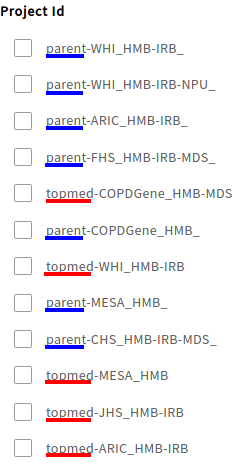

# Parent and TOPMed Studies

## How to Distinguish Between Parent and TOPMed Studies on Gen3 BioData Catalyst.

The two different study types, Parent and TOPMed, have been separated on Gen3 by Program. This division by Program is most visible mechanism to differentiate the two different studies.

These two Programs can be further identified by the following Project name. All Parent studies will also end in an `_` \(underscore\) to further differentiate them within the Gen3 BioData Catalyst system.

## Parent and TOPMed Study Contents.

The most notable difference in these two Program types are the type of data available. The following is what you can expect to find in the two Programs:

* TOPMed
  * Genomic data: This includes files like CRAM, VCFs and Cohort Level VCFs.
  * Phenotypic data: TOPMed studies that do not have a Parent counter part study, there will be phenotypic data for the patients. The phenotypic data in the graph is only DCC harmonized variables, but raw data for the project can be found `reference_file` node.
* Parent
  * Phenotypic data: 

