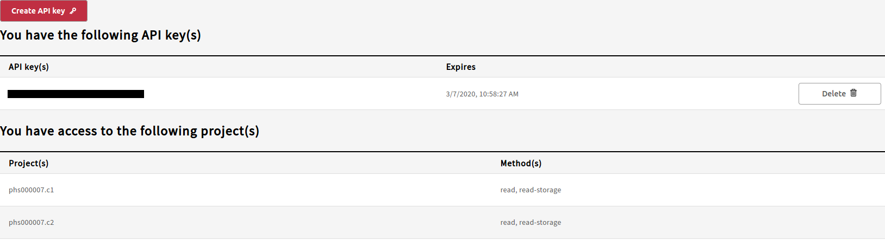

# Profile

## Profile Page

The profile page contains two sections: API keys and Project access.

### API key\(s\)

To download large amounts of data, an API key will be required as a part of the [gen3-client](https://gen3.org/resources/user/gen3-client/). To create a key on your local machine, click the `Create API key` button which will activate the following pop-up window:

Click the `Download json` button to save the credential file to the local machine. After completion, a new entry will appear in the API key\(s\) section of the Profile page. It will display the API key `key_id` and the expiration date \(one month after the key creation\). The user should delete the key after it has expired. If for any reason a user feels that their API key has been compromised, the key should be deleted before subsequently creating a new one.

### Project Access

This section of the Profile page will list the projects and the methods of access for the data within in the Gen3 BioData Catalyst system. If you are not seeing access to a specific study, please check that you have been granted access within [dbGaP](https://www.ncbi.nlm.nih.gov/gap/) first. If access has been granted for over a week, please contact the BioData Catalyst Help Desk: bdcat-support@datacommons.io

