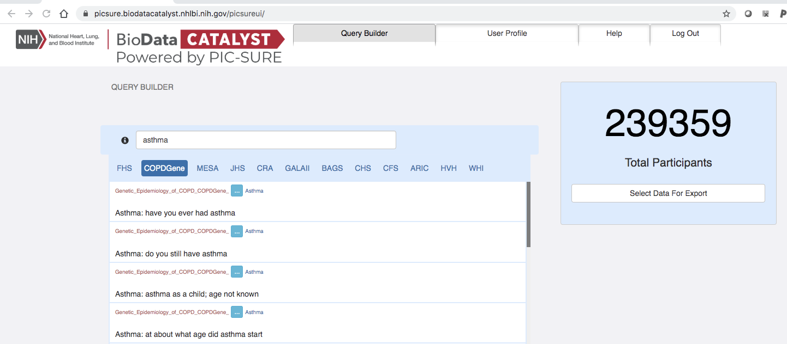
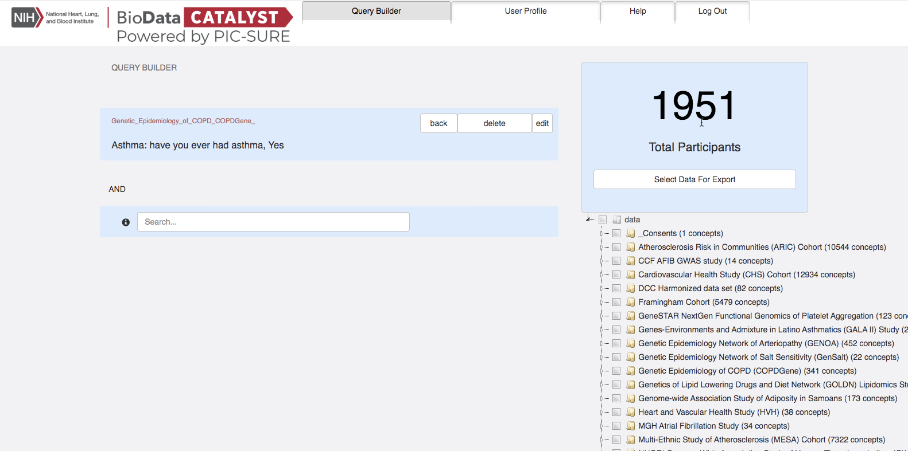
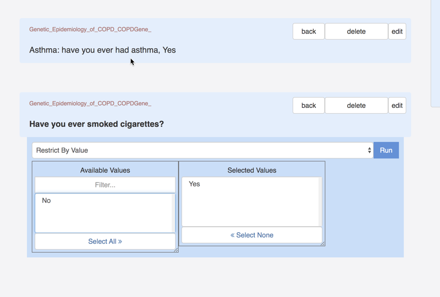
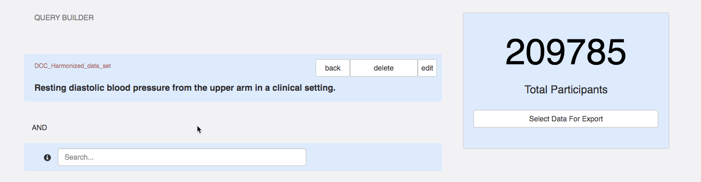

# PIC-SURE for BioData Catalyst User Guide

**PIC-SURE for BioData Catalyst User Guide**

As part of the [BioData Catalyst](https://biodatacatalyst.nhlbi.nih.gov/) initiative, the Patient Information Commons Standard Unification of Research Elements \(PIC-SURE\) platform has been integrating clinical and genomic datasets from multiple TOPMed and TOPMed related studies funded by the National Heart Lung and Blood Institute \(NHLBI\). The PIC-SURE User Interface allows for an investigator to search available data and conduct feasibility queries, allowing for cohorts to be built in real-time and results to be exported via the PIC-SURE API for analysis.

It is important to note that the BioData Catalyst is consistently onboarding new data that will become available as it is implemented.

## 

## 

## **Authorization and Access**

To obtain access to PIC-SURE on BioData Catalyst:

1. You must have an NIH eRA commons account or an NIH username and password. [Please see these instructions](https://era.nih.gov/commons/#Commons/1_Admin/mgacct_create.htm%3FTocPath%3D_____24).
2. You must have an active dbGaP Data Access Request Approval, for more information on how to obtain access to data please visit the [BioData Catalyst Data Access webpage.](https://biodatacatalyst.nhlbi.nih.gov/resources/data)
3. Navigate to the [https://biodatacatalyst.nhlbi.nih.gov/](https://biodatacatalyst.nhlbi.nih.gov/). Click on **Resources**. This will bring down a drop-down menu, choose **SERVICES.** Services will bring you to the list of platforms and services on the BioData Catalyst ecosystem. To access **PIC-SURE,** scroll down to BioData Catalyst powered by PIC-SURE and click **Launch**. **This will direct you to the log-in screen or go directly to** [**https://picsure.biodatacatalyst.nhlbi.nih.gov**](https://picsure.biodatacatalyst.nhlbi.nih.gov/)**.**

1. You will be directed to the log-in page where you can log-in using your NIH eRA commons account information.

1. You will then be directed to the NIH website to log-in with your eRA commons credentials. Enter your credentials and you will be directed back to the BioData Catalyst authorization page.

1. You will be asked to authorize BioData Catalyst-HMS integration to know your account information and what you are authorized to access. This process allows for the PIC-SURE User Interface on the BioData Catalyst Ecosystem to know the data are authorized to access.

**Note: If you do not have access to any data you will be redirected back to the login page. Please go to** [**BioData Catalyst Data Access webpage**](https://biodatacatalyst.nhlbi.nih.gov/resources/data) **to learn how to obtain access to data.**

## **AVAILABLE DATA**

### TOPMed Freeze 5b Data

Currently the PIC-SURE User Interface has integrated the clinical data from all studies listed in the table below. Genomic data can be accessed from other BioData Catalyst platforms.

| **Study Accession** | **Study/Cohort Abbreviation** | **Study Name** |
| :--- | :--- | :--- |
| **phs000007** | FHS | [Framingham Cohort](https://www.ncbi.nlm.nih.gov/projects/gap/cgi-bin/study.cgi?study_id=phs000007.v30.p11) |
| **phs000179** | COPDGene | [Genetic Epidemiology of COPD \(COPDGene\) Funded by the National Heart, Lung, and Blood Institute](https://www.ncbi.nlm.nih.gov/projects/gap/cgi-bin/study.cgi?study_id=phs000179.v6.p2) |
| **phs000200** | WHI | [Women's Health Initiative Clinical Trial and Observational Study](https://www.ncbi.nlm.nih.gov/projects/gap/cgi-bin/study.cgi?study_id=phs000200.v12.p3) |
| **phs000209** | MESA | [Multi-Ethnic Study of Atherosclerosis \(MESA\) Cohort](https://www.ncbi.nlm.nih.gov/projects/gap/cgi-bin/study.cgi?study_id=phs000209.v13.p3) |
| **phs000280** | ARIC | [Atherosclerosis Risk in Communities \(ARIC\) Cohort](https://www.ncbi.nlm.nih.gov/projects/gap/cgi-bin/study.cgi?study_id=phs000280.v6.p1) |
| **phs000284** | CFS | [NHLBI Cleveland Family Study \(CFS\) Candidate Gene Association Resource \(CARe\)](https://www.ncbi.nlm.nih.gov/projects/gap/cgi-bin/study.cgi?study_id=phs000284.v2.p1) |
| **phs000286** | JHS | [Jackson Heart Study \(JHS\) Cohort](https://www.ncbi.nlm.nih.gov/projects/gap/cgi-bin/study.cgi?study_id=phs000286.v6.p2) |
| **phs000287** | CHS | [Cardiovascular Health Study \(CHS\) Cohort: an NHLBI-funded observational study of risk factors for cardiovascular disease in adults 65 years or older](https://www.ncbi.nlm.nih.gov/projects/gap/cgi-bin/study.cgi?study_id=phs000287.v6.p1) |
| **phs000289** | Mayo\_VTE | [National Human Genome Research Institute \(NHGRI\) GENEVA Genome-Wide Association Study of Venous Thrombosis \(GWAS of VTE\)](https://www.ncbi.nlm.nih.gov/projects/gap/cgi-bin/study.cgi?study_id=phs000289.v2.p1) |
| **phs000741** | GOLDN | [Genetics of Lipid Lowering Drugs and Diet Network \(GOLDN\) Lipidomics Study](https://www.ncbi.nlm.nih.gov/projects/gap/cgi-bin/study.cgi?study_id=phs000741.v2.p1) |
| **phs000784** | GenSalt | [Genetic Epidemiology Network of Salt Sensitivity \(GenSalt\)](https://www.ncbi.nlm.nih.gov/projects/gap/cgi-bin/study.cgi?study_id=phs000784.v3.p1) |
| **phs000820** | CCAF | [The Cleveland Clinic Foundation's Lone Atrial Fibrillation GWAS Study](https://www.ncbi.nlm.nih.gov/projects/gap/cgi-bin/study.cgi?study_id=phs000820.v1.p1) |
| **phs000914** | SAS | [Genome-wide Association Study of Adiposity in Samoans](https://www.ncbi.nlm.nih.gov/projects/gap/cgi-bin/study.cgi?study_id=phs000914.v1.p1) |
| **phs000920** | GALAII | [NHLBI TOPMed: Genes-environments and Admixture in Latino Asthmatics \(GALA II\) Study](https://www.ncbi.nlm.nih.gov/projects/gap/cgi-bin/study.cgi?study_id=phs000920.v4.p2) |
| **phs000921** | SAGE | [NHLBI TOPMed: Study of African Americans, Asthma, Genes and Environment \(SAGE\) Study](https://www.ncbi.nlm.nih.gov/projects/gap/cgi-bin/study.cgi?study_id=phs000921.v4.p1) |
| **phs000946** | EOCOPD | [NHLBI TOPMed: Boston Early-Onset COPD Study in the National Heart, Lung, and Blood Institute \(NHLBI\) Trans-Omics for Precision Medicine \(TOPMed\) Program](https://www.ncbi.nlm.nih.gov/projects/gap/cgi-bin/study.cgi?study_id=phs000946.v4.p1) |
| **phs000951** | COPDGene | [NHLBI TOPMed: Genetic Epidemiology of COPD \(COPDGene\)](https://www.ncbi.nlm.nih.gov/projects/gap/cgi-bin/study.cgi?study_id=phs000951.v3.p3) |
| **phs000954** | CFS | [NHLBI TOPMed: The Cleveland Family Study - Whole Genome Sequencing](https://www.ncbi.nlm.nih.gov/projects/gap/cgi-bin/study.cgi?study_id=phs000954.v3.p2) |
| **phs000956** | Amish | [NHLBI TOPMed: Genetics of Cardiometabolic Health in the Amish](https://www.ncbi.nlm.nih.gov/projects/gap/cgi-bin/study.cgi?study_id=phs000956.v4.p1) |
| **phs000964** | JHS | [NHLBI TOPMed: The Jackson Heart Study](https://www.ncbi.nlm.nih.gov/projects/gap/cgi-bin/study.cgi?study_id=phs000964.v4.p1) |
| **phs000972** | SAS | [Genome-wide Association Study of Adiposity in Samoans](https://www.ncbi.nlm.nih.gov/projects/gap/cgi-bin/study.cgi?study_id=phs000972.v4.p1) |
| **phs000974** | FHS | [NHLBI TOPMed: Genomic Activities such as Whole Genome Sequencing and Related Phenotypes in the Framingham Heart Study](https://www.ncbi.nlm.nih.gov/projects/gap/cgi-bin/study.cgi?study_id=phs000974.v4.p3) |
| **phs000988** | CRA | [NHLBI TOPMed: The Genetic Epidemiology of Asthma in Costa Rica](https://www.ncbi.nlm.nih.gov/projects/gap/cgi-bin/study.cgi?study_id=phs000988.v3.p1) |
| **phs000993** | HVH | [NHLBI TOPMed: Heart and Vascular Health Study \(HVH\)](https://www.ncbi.nlm.nih.gov/projects/gap/cgi-bin/study.cgi?study_id=phs000993.v4.p2) |
| **phs000997** | VAFAR | [NHLBI TOPMed: The Vanderbilt AF Ablation Registry](https://www.ncbi.nlm.nih.gov/projects/gap/cgi-bin/study.cgi?study_id=phs000997.v4.p2) |
| **phs001001** | MGH\_AF | [Massachusetts General Hospital \(MGH\) Atrial Fibrillation Study](https://www.ncbi.nlm.nih.gov/projects/gap/cgi-bin/study.cgi?study_id=phs001001.v1.p1) |
| **phs001013** | HVH | [Heart and Vascular Health Study \(HVH\)](https://www.ncbi.nlm.nih.gov/projects/gap/cgi-bin/study.cgi?study_id=phs001013.v3.p2) |
| **phs001024** | Partners | [NHLBI TOPMed: Partners HealthCare Biobank](https://www.ncbi.nlm.nih.gov/projects/gap/cgi-bin/study.cgi?study_id=phs001024.v4.p1) |
| **phs001032** | VU\_AF | [NHLBI TOPMed: The Vanderbilt Atrial Fibrillation Registry](https://www.ncbi.nlm.nih.gov/projects/gap/cgi-bin/study.cgi?study_id=phs001032.v5.p2) |
| **phs001040** | WGHS | [NHLBI TOPMed: Novel Risk Factors for the Development of Atrial Fibrillation in Women](https://www.ncbi.nlm.nih.gov/projects/gap/cgi-bin/study.cgi?study_id=phs001040.v3.p1) |
| **phs001062** | MGH\_AF | [NHLBI TOPMed: Massachusetts General Hospital \(MGH\) Atrial Fibrillation Study](https://www.ncbi.nlm.nih.gov/projects/gap/cgi-bin/study.cgi?study_id=phs001062.v3.p2) |
| **phs001074** | GeneSTAR | [GeneSTAR \(Genetic Study of Atherosclerosis Risk\) NextGen Consortium: Functional Genomics of Platelet Aggregation Using iPS and Derived Megakaryocytes](https://www.ncbi.nlm.nih.gov/projects/gap/cgi-bin/study.cgi?study_id=phs001074.v1.p1) |
| **phs001143** | BAGS | [NHLBI TOPMed: The Genetics and Epidemiology of Asthma in Barbados](https://www.ncbi.nlm.nih.gov/projects/gap/cgi-bin/study.cgi?study_id=phs001143.v3.p1) |
| **phs001180** | GALAII | [Genes-Environments and Admixture in Latino Asthmatics \(GALA II\) Study](https://www.ncbi.nlm.nih.gov/projects/gap/cgi-bin/study.cgi?study_id=phs001180.v1.p1) |
| **phs001189** | CCAF | [NHLBI TOPMed: Cleveland Clinic Atrial Fibrillation \(CCAF\) Study](https://www.ncbi.nlm.nih.gov/projects/gap/cgi-bin/study.cgi?study_id=phs001189.v2.p1) |
| **phs001207** | Sarcoidosis | [NHLBI TOPMed: African American Sarcoidosis Genetics Resource](https://www.ncbi.nlm.nih.gov/projects/gap/cgi-bin/study.cgi?study_id=phs001207.v2.p1) |
| **phs001211** | ARIC | [NHLBI TOPMed: Trans-Omics for Precision Medicine \(TOPMed\) Whole Genome Sequencing Project: ARIC](https://www.ncbi.nlm.nih.gov/projects/gap/cgi-bin/study.cgi?study_id=phs001211.v3.p2) |
| **phs001215** | SAFS | [NHLBI TOPMed: San Antonio Family Heart Study \(SAFHS\)](https://www.ncbi.nlm.nih.gov/projects/gap/cgi-bin/study.cgi?study_id=phs001215.v3.p2) |
| **phs001217** | GenSalt | [NHLBI TOPMed: Genetic Epidemiology Network of Salt Sensitivity \(GenSalt\)](https://www.ncbi.nlm.nih.gov/projects/gap/cgi-bin/study.cgi?study_id=phs001217.v2.p1) |
| **phs001218** | GeneSTAR | [NHLBI TOPMed: GeneSTAR \(Genetic Study of Atherosclerosis Risk\)](https://www.ncbi.nlm.nih.gov/projects/gap/cgi-bin/study.cgi?study_id=phs001218.v2.p1) |
| **phs001237** | WHI | [NHLBI TOPMed: Women's Health Initiative \(WHI\)](https://www.ncbi.nlm.nih.gov/projects/gap/cgi-bin/study.cgi?study_id=phs001237.v2.p1) |
| **phs001238** | GENOA | [Genetic Epidemiology Network of Arteriopathy \(GENOA\)](https://www.ncbi.nlm.nih.gov/projects/gap/cgi-bin/study.cgi?study_id=phs001238.v2.p1) |
| **phs001293** | HyperGEN | [NHLBI TOPMed: HyperGEN - Genetics of Left Ventricular \(LV\) Hypertrophy](https://www.ncbi.nlm.nih.gov/projects/gap/cgi-bin/study.cgi?study_id=phs001293.v2.p1) |
| **phs001345** | GENOA | [NHLBI TOPMed: Genetic Epidemiology Network of Arteriopathy \(GENOA\)](https://www.ncbi.nlm.nih.gov/projects/gap/cgi-bin/study.cgi?study_id=phs001345.v2.p1) |
| **phs001359** | GOLDN | [NHLBI TOPMed: GOLDN Epigenetic Determinants of Lipid Response to Dietary Fat and Fenofibrate](https://www.ncbi.nlm.nih.gov/projects/gap/cgi-bin/study.cgi?study_id=phs001359.v2.p1) |
| **phs001368** | CHS | [NHLBI TOPMed: Trans-Omics for Precision Medicine \(TOPMed\) Whole Genome Sequencing Project: Cardiovascular Health Study](https://www.ncbi.nlm.nih.gov/projects/gap/cgi-bin/study.cgi?study_id=phs001368.v2.p2) |
| **phs001387** | THRV | [NHLBI TOPMed: Rare Variants for Hypertension in Taiwan Chinese \(THRV\)](https://www.ncbi.nlm.nih.gov/projects/gap/cgi-bin/study.cgi?study_id=phs001387.v1.p1) |
| **phs001402** | Mayo\_VTE | [NHLBI TOPMed: Whole Genome Sequencing of Venous Thromboembolism \(WGS of VTE\)](https://www.ncbi.nlm.nih.gov/projects/gap/cgi-bin/study.cgi?study_id=phs001402.v2.p1) |
| **phs001412** | DHS | [NHLBI TOPMed: Diabetes Heart Study \(DHS\) African American Coronary Artery Calcification \(AA CAC\)](https://www.ncbi.nlm.nih.gov/projects/gap/cgi-bin/study.cgi?study_id=phs001412.v2.p1) |
| **phs001416** | MESA | [NHLBI TOPMed: MESA and MESA Family AA-CAC](https://www.ncbi.nlm.nih.gov/projects/gap/cgi-bin/study.cgi?study_id=phs001416.v2.p1) |

### Harmonized Data

**TOPMed Harmonized Clinical Variables**

Additionally, there are limited amounts of harmonized data available at this time. The TOPMed Data Coordinating Center curation team has identified forty-four \(44\) variables that are shared across seventeen \(17\) NHLBI studies and has normalized the patient values for these variables. The 17 studies whence the 44 clinical variables have been identified, in alphabetic order, are:

* Atherosclerosis Risk in Communities Study \(ARIC\)
* Cardiovascular Health Study \(CHS\)
* Cleveland Family Study \(CFS\)
* Coronary Artery Risk Development in Young Adults Study \(CARDIA\)
* Epidemiology of Asthma in Costa Rica Study \(CRA\)
* Framingham Heart Study \(FHS\)
* Genetic Epidemiology Network of Arteriopathy \(GENOA\)
* Genetic Epidemiology of COPD \(COPDGene\)
* Genetics of Cardiometabolic Health in Amish \(Amish\)
* Genetics of Lipid Lowering Drugs and Diet Network Study \(GOLDN\)
* Genome-Wide Association Study of Venous Thrombosis Study \(VTE\)
* Heart and Vascular Health Study \(HVH\)
* Hispanic Community Health Study - Study of Latinos \(HCHS\_SOL\)
* Jackson Heart Study \(JHS\)
* Multi-Ethnic Study of Atherosclerosis \(MESA\)
* Study of Adiposity in Samoans \(SAS\)
* Women’s Health Initiative \(WHI\)

**List of harmonized variables:**

| **Variable Name** | **Variable Description** | **TYPE** | **UNITS** | **VARIABLE\_SOURCE** | **VALUES** |
| :--- | :--- | :--- | :--- | :--- | :--- |
| cac\_volume\_1 | Coronary artery calcium volume using CT scan\(s\) of coronary arteries | decimal | cubic millimeters | UMLS |  |
| cac\_score\_1 | Coronary artery calcification \(CAC\) score using Agatston scoring of CT scan\(s\) of coronary arteries | decimal |  | UMLS |  |
| cimt\_1 | Common carotid intima-media thickness, calculated as the mean of two values: mean of multiple thickness estimates from the left far wall and from the right far wall. | decimal | mm | UMLS |  |
| cimt\_2 | Common carotid intima-media thickness, calculated as the mean of four values: maximum of multiple thickness estimates from the left far wall, left near wall, right far wall, and right near wall. | decimal | mm | UMLS |  |
| carotid\_stenosis\_1 | Extent of narrowing of the carotid artery. | encoded |  | UMLS | 0=None\|\|1=1%-24%\|\|2=25%-49%\|\|3=50%-74%\|\|4=75%-99%\|\|5=100% |
| carotid\_plaque\_1 | Presence or absence of carotid plaque. | encoded |  | UMLS | 0=Plaque not present\|\|1=Plaque present |
| height\_baseline\_1 | Body height at baseline. | decimal | cm | UMLS |  |
| current\_smoker\_baseline\_1 | Indicates whether subject currently smokes cigarettes. | encoded |  | UMLS | 0=Does not currently smoke cigarettes\|\|1=Currently smokes cigarettes |
| weight\_baseline\_1 | Body weight at baseline. | decimal | kg | UMLS |  |
| ever\_smoker\_baseline\_1 | Indicates whether subject ever regularly smoked cigarettes. | encoded |  | UMLS | 0=Never a cigarette smoker\|\|1=Current or former cigarette smoker |
| bmi\_baseline\_1 | Body mass index calculated at baseline. | decimal | kg/m^2 | UMLS |  |
| hemoglobin\_mcnc\_bld\_1 | Measurement of mass per volume, or mass concentration \(mcnc\), of hemoglobin in the blood \(bld\). | decimal | g / dL = grams per deciliter | UMLS |  |
| hematocrit\_vfr\_bld\_1 | Measurement of hematocrit, the fraction of volume \(vfr\) of blood \(bld\) that is composed of red blood cells. | decimal | % = percentage | UMLS |  |
| rbc\_ncnc\_bld\_1 | Count by volume, or number concentration \(ncnc\), of red blood cells in the blood \(bld\). | decimal | millions / microliter | UMLS |  |
| wbc\_ncnc\_bld\_1 | Count by volume, or number concentration \(ncnc\), of white blood cells in the blood \(bld\). | decimal | thousands / microliter | UMLS |  |
| basophil\_ncnc\_bld\_1 | Count by volume, or number concentration \(ncnc\), of basophils in the blood \(bld\). | decimal | thousands / microliter | UMLS |  |
| eosinophil\_ncnc\_bld\_1 | Count by volume, or number concentration \(ncnc\), of eosinophils in the blood \(bld\). | decimal | thousands / microliter | UMLS |  |
| neutrophil\_ncnc\_bld\_1 | Count by volume, or number concentration \(ncnc\), of neutrophils in the blood \(bld\). | decimal | thousands / microliter | UMLS |  |
| lymphocyte\_ncnc\_bld\_1 | Count by volume, or number concentration \(ncnc\), of lymphocytes in the blood \(bld\). | decimal | thousands / microliter | UMLS |  |
| monocyte\_ncnc\_bld\_1 | Count by volume, or number concentration \(ncnc\), of monocytes in the blood \(bld\). | decimal | thousands / microliter | UMLS |  |
| platelet\_ncnc\_bld\_1 | Count by volume, or number concentration \(ncnc\), of platelets in the blood \(bld\). | integer | thousands / microliter | UMLS |  |
| mch\_entmass\_rbc\_1 | Measurement of the average mass \(entmass\) of hemoglobin per red blood cell\(rbc\), known as mean corpuscular hemoglobin \(MCH\). | decimal | pg = picogram | UMLS |  |
| mchc\_mcnc\_rbc\_1 | Measurement of the mass concentration \(mcnc\) of hemoglobin in a given volume of packed red blood cells \(rbc\), known as mean corpuscular hemoglobin concentration \(MCHC\). | decimal | g /dL = grams per deciliter | UMLS |  |
| mcv\_entvol\_rbc\_1 | Measurement of the average volume \(entvol\) of red blood cells \(rbc\), known as mean corpuscular volume \(MCV\). | decimal | fL = femtoliter | UMLS |  |
| pmv\_entvol\_bld\_1 | Measurement of the mean volume \(entvol\) of platelets in the blood \(bld\), known as mean platelet volume \(MPV or PMV\). | decimal | fL = femtoliter | UMLS |  |
| rdw\_ratio\_rbc\_1 | Measurement of the ratio of variation in width to the mean width of the red blood cell \(rbc\) volume distribution curve taken at +/- 1 CV, known as red cell distribution width \(RDW\). | decimal | % = percentage | UMLS |  |
| bp\_systolic\_1 | Resting systolic blood pressure from the upper arm in a clinical setting. | decimal | mmHg | UMLS |  |
| bp\_diastolic\_1 | Resting diastolic blood pressure from the upper arm in a clinical setting. | decimal | mmHg | UMLS |  |
| antihypertensive\_meds\_1 | Indicator for use of antihypertensive medication at the time of blood pressure measurement. | encoded |  | UMLS | 0=Not taking antihypertensive medication\|\|1=Taking antihypertensive medication |
| race\_1 | Harmonized race category of participant. | encoded |  | UMLS | AI\_AN=American Indian\_Alaskan Native or Native American\|\|Asian=Asian\|\|Black=Black or African American\|\|HI\_PI=Native Hawaiian or other Pacific Islander\|\|Multiple=More than one race\|\|Other=Other race\|\|White=White or Caucasian |
| ethnicity\_1 | Indicator of Hispanic or Latino ethnicity. | encoded |  | UMLS | both=ethnicity component dbGaP variable values for a subject were inconsistent/contradictory \(e.g. over multiple visits\)\|\|HL=Hispanic or Latino\|\|notHL=not Hispanic or Latino |
| hispanic\_subgroup\_1 | classification of Hispanic/Latino background for Hispanic/Latino subjects where country or region of origin information is available | encoded |  | UMLS | CentralAmerican=Central American\|\|CostaRican=from Costa Rica\|\|Cuban=Cuban\|\|Dominican=Dominican\|\|Mexican=Mexican\|\|PuertoRican=Puerto Rican\|\|SouthAmerican=South American |
| annotated\_sex\_1 | Subject sex, as recorded by the study. | encoded |  | UMLS | female=Female\|\|male=Male |
| geographic\_site\_1 | Recruitment/field center, baseline clinic, or geographic region. | encoded |  | UMLS |  |
| subcohort\_1 | A distinct subgroup within a study, generally indicating subjects who share similar characteristics due to study design. Subjects may belong to only one subcohort. | encoded |  | UMLS |  |
| lipid\_lowering\_medication\_1 | Indicates whether participant was taking any lipid-lowering medication at blood draw to measure lipids phenotypes | encoded |  | UMLS | 0=Participant was not taking lipid-lowering medication\|\|1=Participant was taking lipid-lowering medication. |
| fasting\_lipids\_1 | Indicates whether participant fasted for at least eight hours prior to blood draw to measure lipids phenotypes. | encoded |  | UMLS | 0=Participant did not fast\_or fasted for fewer than eight hours prior to measurement of lipids phenotypes.\|\|1=Participant fasted for at least eight hours prior to measurement of lipids phenotypes. |
| total\_cholesterol\_1 | Blood mass concentration of total cholesterol | decimal | mg/dL | UMLS |  |
| triglycerides\_1 | Blood mass concentration of triglycerides | decimal | mg/dL | UMLS |  |
| hdl\_1 | Blood mass concentration of high-density lipoprotein cholesterol | decimal | mg/dL | UMLS |  |
| ldl\_1 | Blood mass concentration of low-density lipoprotein cholesterol | decimal | mg/dL | UMLS |  |
| vte\_prior\_history\_1 | An indicator of whether a subject had a venous thromboembolism \(VTE\) event prior to the start of the medical review process \(including self-reported events\). | encoded |  | UMLS | 0=did not have prior VTE event\|\|1=had prior VTE event |
| vte\_case\_status\_1 | An indicator of whether a subject experienced a venous thromboembolism event \(VTE\) that was verified by adjudication or by medical professionals. | encoded |  | UMLS | 0=Not known to ever have a VTE event\_either self-reported or from medical records\|\|1=Experienced a VTE event as verified by adjudication or by medical professionals |
| age | age at measurement | decimal | years |  |  |

## 

## What Can I Access?

Check the data you have access to by going to the following BioData Catalyst Website: [https://biodatacatalyst.nhlbi.nih.gov/resources/data](https://biodatacatalyst.nhlbi.nih.gov/resources/data).

Scroll down to the bottom and click on the “Check My Access” box.

## SEARCH

This section will outline the following:

1. Overview of PIC-SURE search layout
2. One criterion search
3. Multiple criteria search: \(i.e.: age and disease\)
4. Search using harmonized variables

### Search Layout

Once you have logged in to the PIC-SURE User Interface, you will see the total number of participants available based on the data you can access. Additionally, from here you can also navigate to the list of studies you are authorized to access.

To see a list of studies you have access to click select data for export which will bring down a data tab. Click on the small triangle to expand the tree and see a listing of all studies.

To begin your query, type directly into the search bar. For example, if you were interested in asthma you can start your search by typing the word “**asthma**” into the search box and hit enter to begin the search. All studies that include “asthma” will be displayed. This includes cases where the word “asthma” is in the variable name, or where “asthma” is in the results \(the value for the variable\).

Below is an example of searching for “**asthma**.” There are 3 main fields where you can.

1. Shown with the black arrow, the display shows the abbreviated study name. You can toggle between studies to see the specific variables available for each study. This example shows that we are currently viewing data for the FHS study, which is the abbreviated name for The Framingham Heart Study. A full list of abbreviations and full study names is located [he]()[re](). Additionally, if you know you are interested in a specific study, you can type in either the full or abbreviated study name and results for that study will be displayed.
2. Shown with the purple arrow, for each study there are different subsets of data available. For example, here for the Framingham Heart Study we can choose to look at the variables under all results or we can select to look at a subset such as the Clinical Questionnaire.
3. Shown with the blue arrow, are the actual variables. Given our search of “asthma” we can drill down further and select the specific variable we are interested in viewing the results for. Once you select the variable of interest the number of participants with data for that variable will be displayed.

### One-Criteria Search

Once you determine the variables and studies you are interested in you can further refine your query to find the number of patients available in the cohort. For example, after looking through the various studies and variables, you want to build a cohort of individuals who have had asthma. You can type in “**asthma**” and find the relevant variables. You can choose “Have you ever had asthma”

Clicking on the variable name allows for further refinement of your query. All available values are included here. For this variable, the available values are “Yes”, “No”, and “I don’t know.”: If you are interested in those individuals who have had asthma you can filter by clicking the “Yes” and adding this to the selected values.

The user can then select to run the query. This will return the total number of participants in the COPDGene study who have identified as having had asthma.

If you are done with your query, you can then click on the “**Select Data For Export**” button. This will produce a tree showing the underlying data. Click the small triangle to expand the tree with the underlying data.

Clicking this brings shows the user a full listing of the available studies and data; however, only the available concepts/variables that match the search criteria for each study will be available. In this case we would scroll to the COPDGene study to retrieve the data of interest.

## As you look at the available data for export, you can see there are 341 concepts \(variables\) available in this COPDGene and 1,951 observations that match our 1,951 participants that stated they have asthma are available.

For my analysis I’m only interested in the phenotype data and subject specific data so I will unclick the other boxes and choose to “**Prepare Export for Analysis**.”

Note while I’m selecting all subject phenotype data, I have the ability to keep or remove any of the variables. I can do this by expanding the tree. For example, if I am not interested in retrieving data for stomach ulcers I could remove that from my data by unchecking the box next to this variable.

Based on my selection of all available variables for the COPDGene study. The platform will then prepare a list of subject identifiers and all phenotypic variables \(328 concepts/variables\) and Subjects variables \(5 concepts/variables\) for the study for all participants \(n=1,951\) who answered yes to the question “Ever had asthma.” I then have the option to download the data to a csv for analysis. Additionally, the system assigns a query Id that can be used in conjunction with the PIC-SURE API to import the data into another BioData Catalyst platform for analysis such as Seven Bridges or Terra using a Jupyter Notebook. This query ID can also be used in PIC-SURE later, serving as a reference for the user to return to previously built queries in PIC-SURE. NOTE: As you click to “**Prepare for Export** '' you will have to scroll all the way down to the bottom of the screen to see when it is available.

### Multiple-Criteria Search

You can add elements to your query to further refine your cohort. Going back to the original query of looking at the COPDGene study answered “Yes” to ever had asthma. We can add other variables to this.

Adding to this query. I want to also look at variables around smoking by typing the word “**smoke**.”

I want to continue looking at the COPDGene study and want to look at the variable “Have you ever smoked cigarettes” and will filter on “Yes”

The results are updated based on the addition of the new variable.

In most cases, when looking at unharmonized data there is not the ability to combine studies when performing a query because participants will not be found in multiple studies. To obtain data from multiple studies it is best to conduct separate queries for each, then combine files at the time of analysis. As a note of caution, there are limited harmonized variables currently available. Combining data from multiple studies needs to be done with care and in conjunction with using the study documentation and data dictionaries to ensure you are comparing similar variables.

### Harmonized Variable Search

There are limited amounts of harmonized data available at this time. The TOPMed Data Coordinating Center curation team has identified forty-four \(44\) variables that are shared across seventeen \(17\) NHLBI studies and has normalized the participant values for these variables. See the section on [Harmonized Data]() for more information about harmonized variables.

To search for harmonized variables, log-in to the PIC-SURE User Interface. Type in the variable of interest \([see list of harmonized variables]()\). This example uses Blood Pressure. Type “**blood pressure**” into the search bar.

When you hit enter, you will see the studies that contain the term blood pressure. When the term you searched is one of the harmonized variables and you have access to studies that include these harmonized variables. The first “study” that comes up is for the “**HarmonizedVariables.**” This will allow for you to search and refine cohorts using these terms, across all the harmonized studies that you are authorized to access.

I’m interested in exploring diastolic blood pressure. I can scroll through the options and I choose “_Resting diastolic blood pressure from the upper arm in a clinical setting_.”

Once I click that variable, it is automatically set to allow for me to restrict by a certain range. From this window, there is the option to not restrict at all. I’m going to choose not to restrict by a specific value to see how many participants I have in the harmonized dataset that have a resting diastolic blood pressure. This result gives the number of participants with a value for this variable across all the harmonized studies that you are authorized to access.

Once I run this query, I can see there are 209,785 total participants with results for this variable.

Now if I want to restrict the results further to narrow down the cohort. I can click edit and restrict by numeric value. I can see the values for the variable range from 0- max: 162.5. I can choose to restrict my numeric value, _pick either less, than or equal to 90_.

This result gives the number of participants with a resting diastolic blood pressure from the upper arm in a clinical setting for this variable across all the harmonized studies that you are authorized to access.

You can also further refine the query using the harmonized variables. For example, maybe you only want to study females and you restrict using the variable “**sex**” restrict by value by selcting females and runnning the query.

You could also query for this by typing “**female**” and selecting the “HarmonizedVariables” option.

Now that you have refined the query to have the criteria you need for your analysis, you can export the data. To export the harmonized variables go to “**Select Data For Export**”

This will produce a tree showing the underlying data. Click the small triangle to expand the tree with the underlying data.

Clicking the triangle to expand the tree displays a full listing of the available studies and data. To retrieve the harmonized variables, click the checkbox for “**DCC Harmonized data set**” From this menu you can select the variables of interest that you want to export. Based on my query I will choose blood pressure and demographic variables to export. Data exports will only include data from the harmonized studies the user is authorized to access.

## Data Analysis Using the PIC-SURE API

Once you have refined your queries and created your cohorts you can begin analyzing data using the BioData Catalyst Ecosystem. The followi

**What is the PIC-SURE API?**

Databases exposed through PIC-SURE API encompass a wide heterogeneity of architectures and data organizations underneath. PIC-SURE hides this complexity and exposes the different databases in the same format, allowing researchers to focus on the analysis and medical insights, thus easing the process of reproducible sciences.

**More about PIC-SURE:**

PIC-SURE stands for Patient-centered Information Commons: Standardized Unification of Research Elements. The API is available in two different programming languages, python and R, allowing investigators to query databases in the same way using any of those languages.

PIC-SURE is a large project from which the R/python PIC-SURE API is only a brick. Among other things, PIC-SURE also offers a graphical user interface, allowing research scientists to get quick knowledge about variables and data available for a specific data source.

The PIC-SURE API tutorial notebooks can be accessed from the following Github repository: [https://github.com/hms-dbmi/Access-to-Data-using-PIC-SURE-API/tree/master/NHLBI\_BioData\_Catalyst](https://github.com/hms-dbmi/Access-to-Data-using-PIC-SURE-API/tree/master/NHLBI_BioData_Catalyst)

Or can be accessed directly from your workspace on NHLBI BioData Catalyst [Seven Bridges Platform](https://platform.sb.biodatacatalyst.nhlbi.nih.gov/) under Public Projects and choosing the PIC-SURE API.

