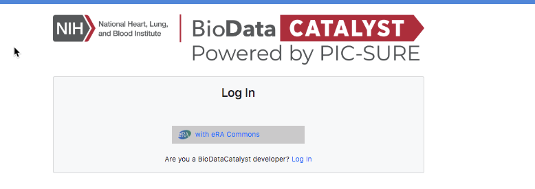
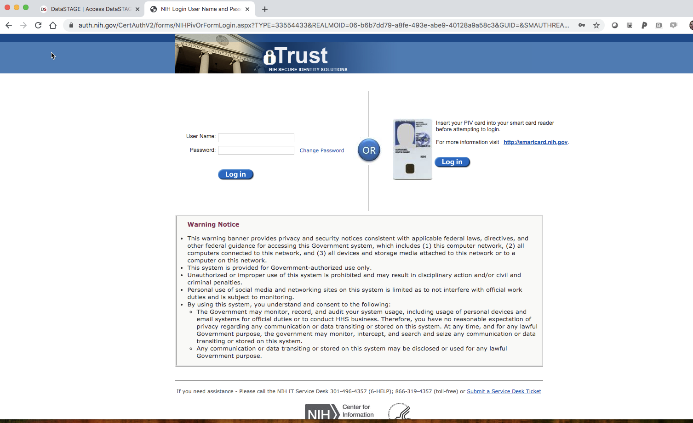
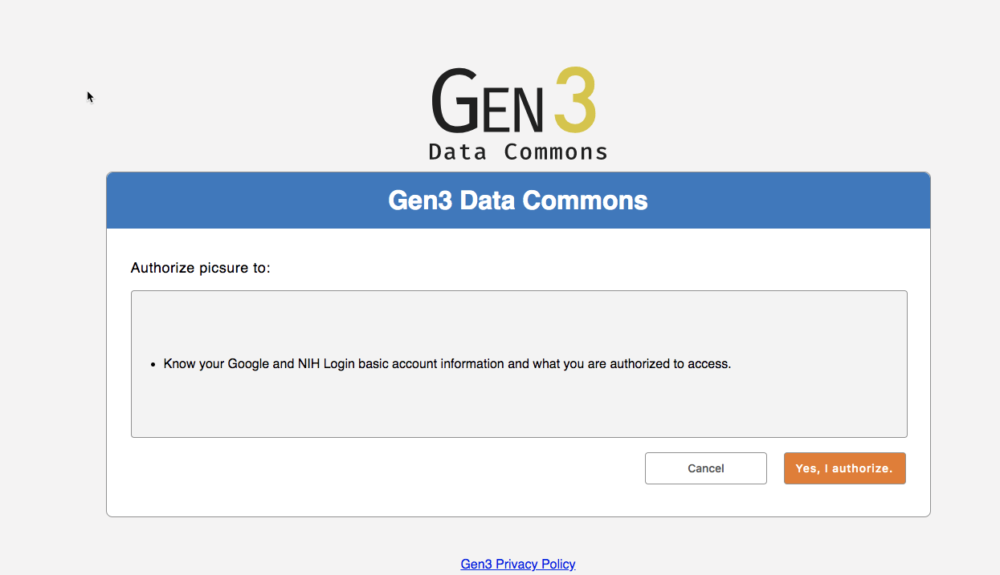

# Authorization and Access

To obtain access to PIC-SURE on BioData Catalyst:

1. You must have an NIH eRA commons account or an NIH username and password. [Please see these instructions](https://era.nih.gov/register-accounts/understanding-era-commons-accounts.htm).
2. You must have an active dbGaP Data Access Request Approval, for more information on how to obtain access to data please visit the [BioData Catalyst Data Access webpage.](https://biodatacatalyst.nhlbi.nih.gov/resources/data)
3. Navigate to the [https://biodatacatalyst.nhlbi.nih.gov/](https://biodatacatalyst.nhlbi.nih.gov/). Click on **Resources**. This will bring down a drop-down menu, choose **SERVICES.** Services will bring you to the list of platforms and services on the BioData Catalyst ecosystem. To access **PIC-SURE,** scroll down to BioData Catalyst powered by PIC-SURE and click **Launch**. **This will direct you to the log-in screen or go directly to** [**https://picsure.biodatacatalyst.nhlbi.nih.gov**](https://picsure.biodatacatalyst.nhlbi.nih.gov/)**.**

1. You will be directed to the log-in page where you can log-in using your NIH eRA commons account information.

1. You will then be directed to the NIH website to log-in with your eRA commons credentials. Enter your credentials and you will be directed back to the BioData Catalyst authorization page.

1. You will be asked to authorize BioData Catalyst-HMS integration to know your account information and what you are authorized to access. This process allows for the PIC-SURE User Interface on the BioData Catalyst Ecosystem to know the data are authorized to access.

**Note: If you do not have access to any data you will be redirected back to the login page. Please go to** [**BioData Catalyst Data Access webpage**](https://biodatacatalyst.nhlbi.nih.gov/resources/data) **to learn how to obtain access to data.**

## \*\*\*\*

