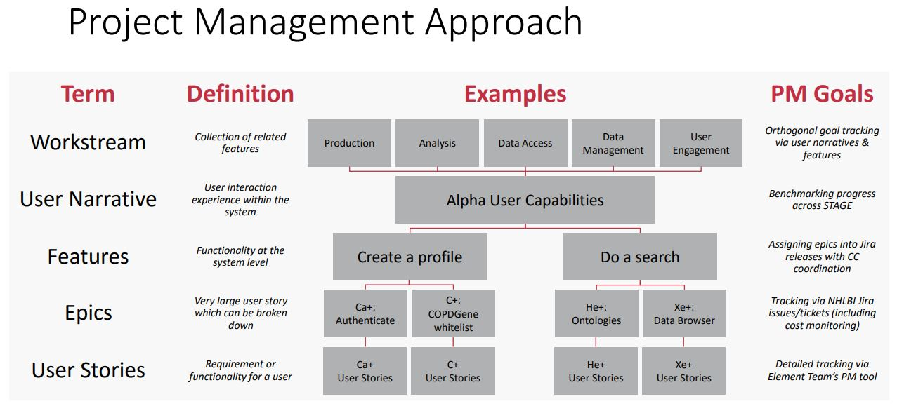

# Strategic Planning

In the context of agile development and a Consortium with a diverse set of members, the application of various agile-development terms may mean different things to different individuals.

The table below defines the BioData Catalyst Core Terminology:

<table>
  <thead>
    <tr>
      <th style="text-align:left"><b>Term</b>
      </th>
      <th style="text-align:left"><b>Definition/Description</b>
      </th>
      <th style="text-align:left"><b>Example</b>
      </th>
    </tr>
  </thead>
  <tbody>
    <tr>
      <td style="text-align:left">User Narrative</td>
      <td style="text-align:left">Descriptions of a user interaction experience within the system from the
        perspective of a particular persona. User Narratives are further broken
        down into Features, Epics, and User Stories. Currently formulated into
        rough 6-month timelines to benchmark progress.</td>
      <td style="text-align:left">An experience bioinformatician wants to search TOPMed studies for a qualitative
        trait to be used in a GWAS study</td>
    </tr>
    <tr>
      <td style="text-align:left">Feature</td>
      <td style="text-align:left">
        
A functionality at the system level that fulfills a meaningful stakeholder
          need

        
*Level at which the BDC3 coordinates

      </td>
      <td style="text-align:left">Search TOPMed datasets using PIC-SURE platform</td>
    </tr>
    <tr>
      <td style="text-align:left">Epic</td>
      <td style="text-align:left">
        
A very large user story which can be broken down into executable stories

        
*NHLBI&#x2019;s cost-monitoring level

      </td>
      <td style="text-align:left">PIC-SURE is accessible on BioData Catalyst</td>
    </tr>
    <tr>
      <td style="text-align:left">User Stories</td>
      <td style="text-align:left">
        
A backlog item that describes a requirement or functionality for a user

        
*Finest level of PM Monitoring

      </td>
      <td style="text-align:left">A user can access PIC-SURE through an icon on BioData Catalyst to initiate
        search</td>
    </tr>
    <tr>
      <td style="text-align:left">Workstream</td>
      <td style="text-align:left">A collection of related features; orthogonal to a User Narrative</td>
      <td
      style="text-align:left">
        
Workstreams impacted by the User Narrative above include:

        <ul>
          <li>production system</li>
          <li>data analysis</li>
          <li>data access</li>
          <li>data management</li>
        </ul>
        </td>
    </tr>
  </tbody>
</table>



### Strategic Planning Documents Reviewed & Approved by NHLBI Leadership

